# 一、数据库连接池

1、提前创建很多的连接对象，放到缓存中（集合），客户端用时直接从缓存中获取连接，用完连接后一定要还回来。目的，提高数据库的访问效率。

2、模拟代码：

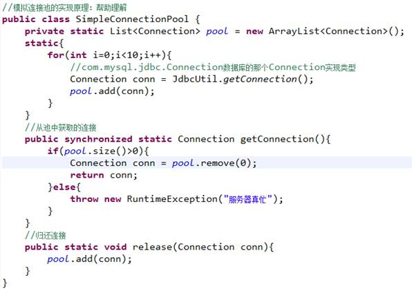

 

# 二、编写标准的数据源

1、SUN定义了一个标准：javax.sql.DataSource接口（数据源）

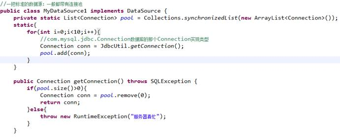

# 三、专题：编程难点

1、更改已知类的某个或某些方法（不能修改原有的代码，应该扩展），有这么几种解决方案：

l 继承：此处不行

l 利用包装设计模式（装饰设计模式）

l 利用动态代理

2、装饰设计模式：IO

口诀：a、编写一个类实现与被包装类（com.mysql.jdbc.Connection）相同的接口

 b、定义一个变量，引用被包装类的实例

​     c、定义构造方法，传入被包装类实例的引用

 d、对于要改变的方法，编写自己的代码即可

 e、对于不需要改变的方法，调用原有对象的对应方法

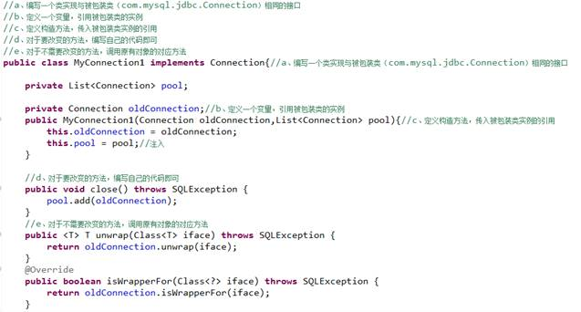

3、默认适配器

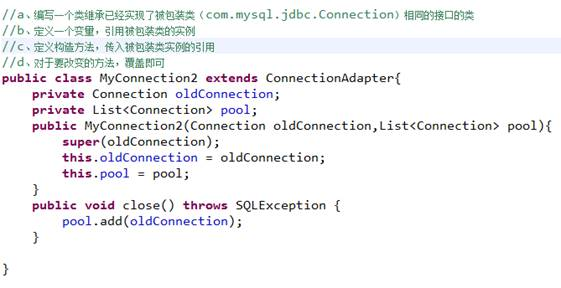

4、基于接口的动态代理：动态代理实现AOP编程的核心技术

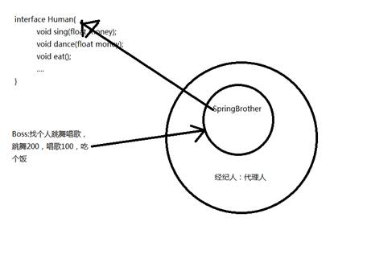

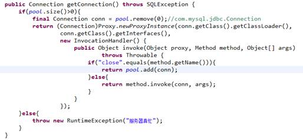

 

5、基于子类的动态代理

CGLIB:基于子类的动态代理

即：代理类是被代理类的子类

 

被代理类要求：

a、必须是public的

b、必须不是final的

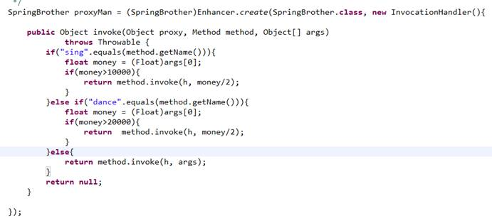

6、AOP：面向切面思想（选听）

横看成岭侧成峰，远近高低各不同

 

# 四、开源数据源的使用（实际开发中用，非常简单）

## 4.1DBCP

a、简介：DBCP DataBase Connection Pool

b、Apache组织搞的开源的数据源（DataSource）实现

c、使用：

1、拷贝jar包：数据库的驱动jar；commons-dbcp-1.4.jar;commons-pool-1.5.6.jar

2、在构建路径的顶层，建立一个配置文件，内容如下：03dbcpconfig.properties

3、编写工具类：

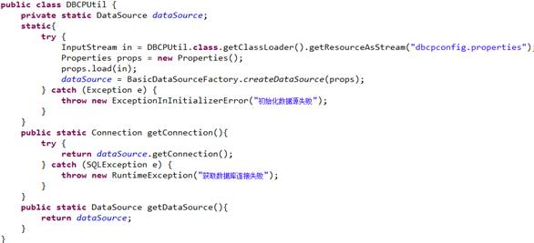

## 4.2 C3P0

a、简介：非常优秀的开源的数据源

b、如何使用：

1、拷贝jar包：c3p0-0.9.1.2.jar；c3p0-0.9.1.2-jdk1.3.jar（JDK版本低）；c3p0-oracle-thin-extras-0.9.1.2.jar（为oracle服务）

2、编写配置文件：参考发行包中的文档

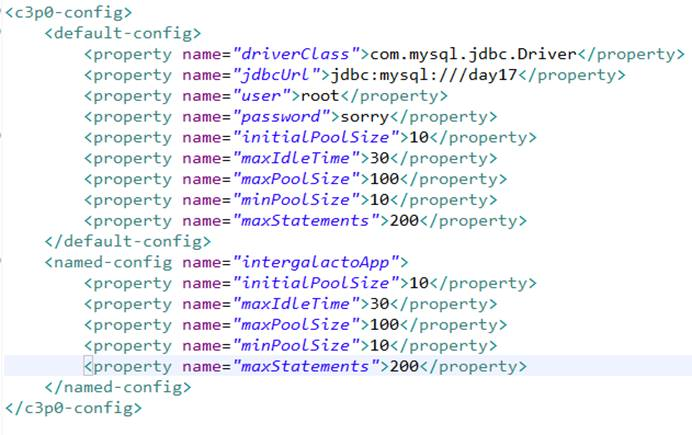

3、编写工具类：

## 4.3利用Tomcat管理数据源

1、JavaWeb服务器一般都提供数据源的实现，一般只需要做一些简单的配置即可。

2、配置Tomcat的数据源

Tomcat一旦配置了数据源，在启动时利用JNDI技术（JavaEE技术之一），把数据源放在JNDI容器中。

JNDI：Java Naming and Directory Interface(Java命名和目录接口)

简单理解：JNDI是一个Map<String,Object>结构的容器,类似window系统的注册表。

 

| key：String                   | value:Object   |
| ----------------------------- | -------------- |
| HEY_SOFTWARE/Microsoft/Ports  |                |
| HEY_MATHINCES/Microsoft/Ports |                |
| java:/comp/env/*jdbc/day17*   | DataSource对象 |

 

3、配置步骤：

a、拷贝数据库驱动jar到Tomcat\lib目录中

b、在应用的META-INF目录下配置一个名称为context.xml的配置文件

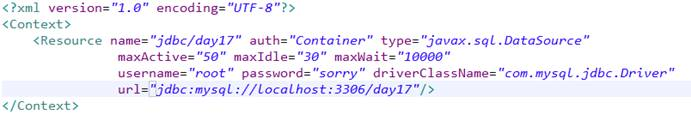

c、从JNDI容器中取出创建好的数据源

使用JNDI的API来取：（javax.naming.*）

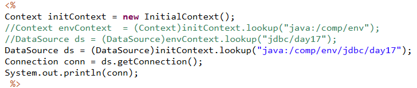

 

# 五、数据库元信息的获取（编写JDBC框架）

1、什么数据库元信息

指数据库、表等的定义信息

2、元信息：

l 数据库的元信息：DatabaseMetaData dmd = conn.getMetaData();//数据库的元信息。全部都是getter方法

l 参数元信息：执行的SQL语句中的占位符元信息

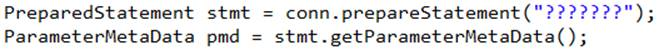

l 结果集元信息:

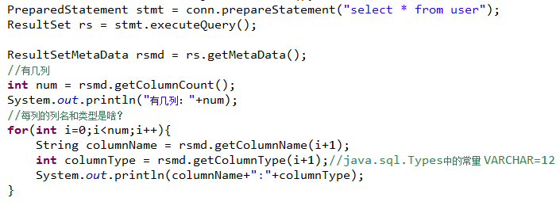

# 六、编写属于自己的JDBC框架

1、目的：简化代码，提高开发效率

 

策略设计模式

 