# 一、文件上传概述

1、文件上传必须满足的条件

a、页面表单的method必须是post

b、页面表单的enctype必须是multipart/form-data类型的

c、表单中提供<input type=”file”/>上传输入域

注意：不适合上传特别大的文件

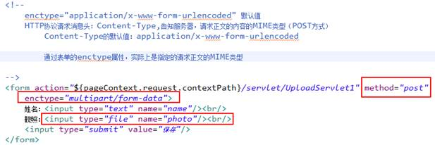

2、请求正文内容的获取

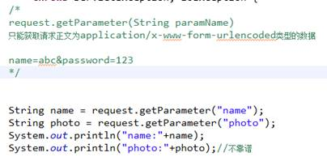

 

# 二、文件上传原理分析

enctype=”multipart/form-data”

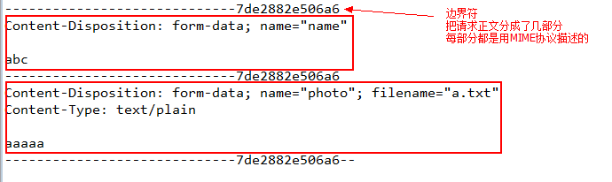

可以用流的方式获取请求正文内容，进一步的解析。

# 三、借助第三方开发包实现文件上传 

Servlet3.0内部提供了对文件上传的支持

(需要Tomcat7.0~以上)

第三方开源工具名称：commons-fileupload（apache）

依赖：commons-io

1、拷贝jar包：

commons-fileupload-1.2.2.jar

commons-io-2.0.1.jar

2、fileupload组件的解析过程

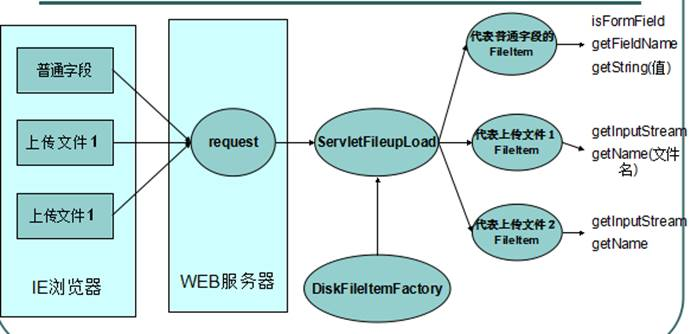

3、主要的类和主要的方法

l DiskFileItemFactory：产生存在磁盘上的FileItem工厂

public void setSizeThreshold(int sizeThreshold)：

设置上传时用的缓存大小。默认是10KB。

public void setRepository(File repository)：

设置上传文件超出缓存大小的磁盘临时文件的存放目录。默认是系统的临时文件存放目录。

构造方法：

DiskFileItemFactory() ：使用默认缓存，默认的临时文件存放目录

DiskFileItemFactory(int sizeThreshold, File repository) ：使用自己制定的缓存和临时文件的存放目录。

l ServletFileUpload：核心的解析请求的类

public static final boolean isMultipartContent(javax.servlet.http.HttpServletRequest request)：判断用户的请求正文是否是multipart/form-data类型。

public List parseRequest(javax.servlet.http.HttpServletRequest request)：解析请求对象，得到所有的表单输入域（每一个域用FileItem表示）

l FileItem：代表每一个表单输入域

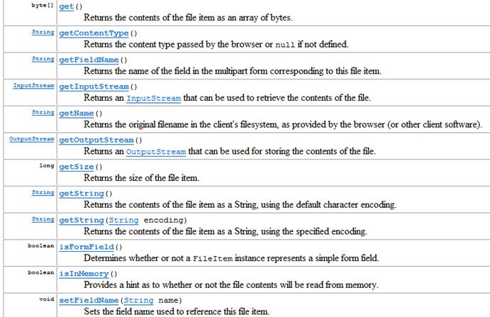

 

 

4、上传代码

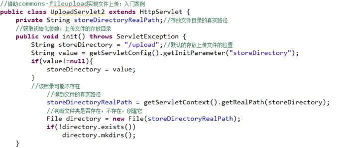

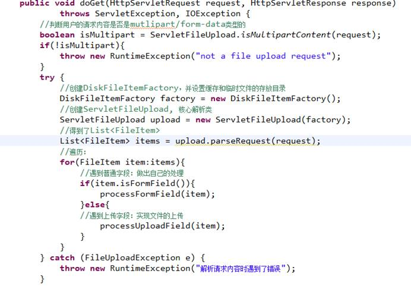

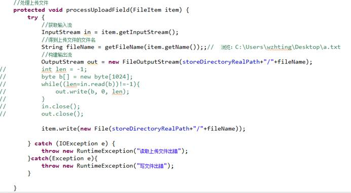

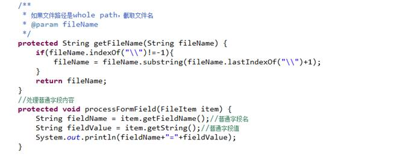

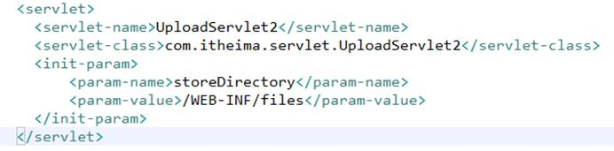

 

 

 

 

 

# 四、文件上传时需要考虑的几个问题

1、如何保证服务器的安全

解决方案：把存放上传文件的目录放到WEB-INF目录下

2、中文乱码问题

2.1普通字段的中文乱码

FileItem.getString(encoding):编码要与浏览器的编码一致

2.2上传文件名是中文

解决方案：request.setCharacterEncoding(encoding)：通知服务器，请求正文的编码类型

3、同一个文件夹下的同名文件被覆盖的问题

解决方案：文件名唯一即可

a.txt----->UUID.randomUUID().toString()_a.txt

 

4、上传文件分目录存储

解决方案：

1、分用户名目录存储

2、按照日期分目录存储（采用的较多）

3、按照文件名的hashCode计算存放目录（二级目录）

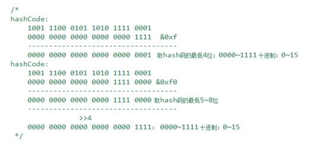

5、限制文件的上传大小

5.1限制单个文件上传大小

5.2限制总文件上传大小（多个上传输入域）

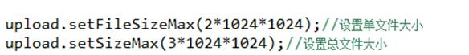

6、限制上传文件的类型

MIME类型+文件的扩展名

只允许上传图片：MIME设置（大类型/小类型）

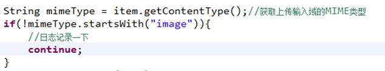

7、临时文件的处理

超出缓存会采用磁盘临时文件来缓存

 

l FileItem.writer():使用该方法处理上传。临时文件会自动清理。（推荐）

l 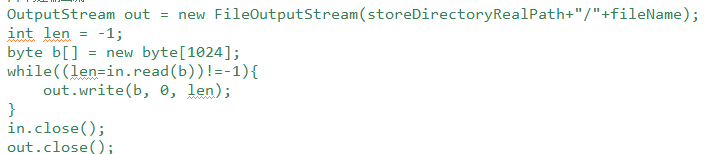

需要手工删除：FileItem.delete()方法

8、文件上传进度条（需要具备AJAX知识）

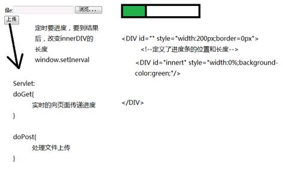

# 五、文件的下载

# 六、观察者设计模式（监听器）

1、事件源：发生事件的对象

2、监听器：监听事件源上的发送的事件

3、事件对象：每发生一个事件都会产生一个事件对象，事件对象中封装了事件源

 

# 七、Servlet规范中的8个监听器

7.1监听ServletContext、HttpSession、ServletRequest对象的创建和销毁的监听器

 

注册监听：web.xml

<listener></listener>

 

ServletContextListener

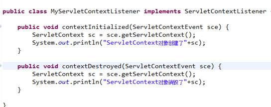

 

HttpSessionListener

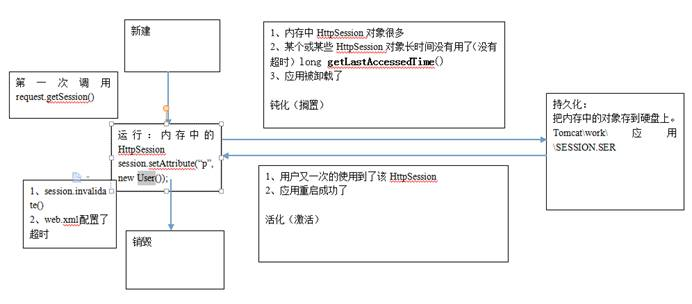

ServletRequestListener:统计网站中资源的访问次数

Map<String,Integer> key:资源的URL，value:访问次数

7.2监听ServletContext、HttpSession、ServletRequest对象中域中数据变化的监听器

ServletContextAttributeListener

HttpSessionAttributeListener

ServletRequestAttributeListener

 

7.3感知型监听器：不需要注册。谁实现了该类型的监听器，就能检测到自身的变化

HttpSessionBindingListener：感知自己何时被绑/解绑HttpSession域中。

HttpSessionActivationListener:感知自己何时随着HttpSession钝化/激活。

 

# 踢人案例

 

 