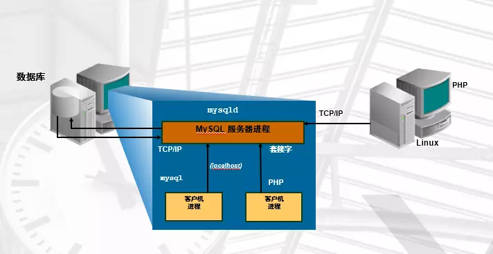
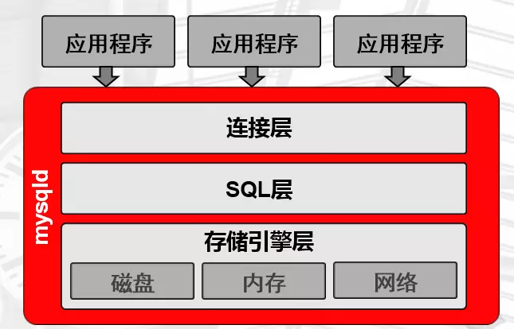

# mysql8.0之前版本 (5.7)

## what is database

数据：文字、图片、视频。。。人类认知的数据表现方式 
		计算机：二进制、16进制的机器语言
		基于数据的重要性和复杂性的不同，我们可能有不同的管理方式。

哪些数据是适合存储到数据库的呢？
		重要性比较高的
		关系较复杂的数据

## what is DBMS

RDBMS: 关系型数据库管理系统
		比较适合于,安全级别要求高的数据以及关系较复杂的数据

NoSQL:非关系型数据库管理系统
		适合于高性能存取数据,一般是配合RDBMS进行使用的
		针对大数据处理分析,分布式架构更加擅长

## install

1.download the 5.7 version mysql and unpack

2.vim the environment path

```bash
vim /etc/profile
export PATH=/app/mysql/bin:$PATH
[root@db01 bin]# source /etc/profile
```

3.create group and user ‘mysql’

user add mysql

4.create relate-index and change auth

```bash
 mkdir /data/mysql -p 
 chown -R mysql.mysql /app/*
 chown -R mysql.mysql /data/*
```

5.init mysql

```bash
初始化数据，初始化管理员的临时密码
mysqld --initialize  --user=mysql --basedir=/app/mysql --datadir=/data/mysql

2019-04-18T03:21:53.381108Z 0 [Warning] TIMESTAMP with implicit DEFAULT value is deprecated. Please use --explicit_defaults_for_timestamp server option (see documentation for more details).
2019-04-18T03:21:54.583415Z 0 [Warning] InnoDB: New log files created, LSN=45790
2019-04-18T03:21:54.697859Z 0 [Warning] InnoDB: Creating foreign key constraint system tables.
2019-04-18T03:21:54.760821Z 0 [Warning] No existing UUID has been found, so we assume that this is the first time that this server has been started. Generating a new UUID: 1daa0c57-6189-11e9-bc80-000c294234c8.
2019-04-18T03:21:54.770856Z 0 [Warning] Gtid table is not ready to be used. Table 'mysql.gtid_executed' cannot be opened.
2019-04-18T03:21:54.772016Z 1 [Note] A temporary password is generated for root@localhost: 9LN.fh_Ea#uU
```

```undefined
报错原因: Linux系统中缺少libaio-devel 软件包
解决:
yum install -y libaio-devel
```

```kotlin
报错原因:
在/data/mysql 存在文件
解决:
\rm -rf /data/mysql/*
```

## config

```properties
vim /etc/my.cnf
[mysqld]
user=mysql
basedir=/app/mysql
datadir=/data/mysql
server_id=6
port=3306
socket=/tmp/mysql.sock
[mysql]
socket=/tmp/mysql.sock
prompt=3306 [\\d]>
```

## 配置启动脚本

```bash
[root@db01 mysql]# cd /app/mysql/support-files
[root@db01 support-files]# ./mysql.server start
Starting MySQL.Logging to '/data/mysql/db01.err'.
 SUCCESS! 
cp mysql.server    /etc/init.d/mysqld
```

## 管理mysql

```bash
vim /etc/systemd/system/mysqld.service 
[Unit]
Description=MySQL Server
Documentation=man:mysqld(8)
Documentation=http://dev.mysql.com/doc/refman/en/using-systemd.html
After=network.target
After=syslog.target
[Install]
WantedBy=multi-user.target
[Service]
User=mysql
Group=mysql
ExecStart=/app/mysql/bin/mysqld --defaults-file=/etc/my.cnf
LimitNOFILE = 5000
```

## 体系结构

  

```bash
TCP/IP方式（远程、本地）：
mysql -uroot -poldboy123 -h 10.0.0.51 -P3306
Socket方式(仅本地)：
mysql -uroot -poldboy123 -S /tmp/mysql.sock
```

### 程序结构

  

### 执行过程

```ruby
1.3.2.1 连接层
（1）提供连接协议：TCP/IP 、SOCKET
（2）提供验证：用户、密码，IP，SOCKET
（3）提供专用连接线程：接收用户SQL，返回结果
通过以下语句可以查看到连接线程基本情况
mysql> show processlist;
```

#### SQL层 

```undefined
（1）接收上层传送的SQL语句
（2）语法验证模块：验证语句语法,是否满足SQL_MODE
（3）语义检查：判断SQL语句的类型
DDL ：数据定义语言
DCL ：数据控制语言
DML ：数据操作语言
DQL： 数据查询语言
...
（4）权限检查：用户对库表有没有权限
（5）解析器：对语句执行前,进行预处理，生成解析树(执行计划),说白了就是生成多种执行方案.
（6）优化器：根据解析器得出的多种执行计划，进行判断，选择最优的执行计划
        代价模型：资源（CPU IO MEM）的耗损评估性能好坏
（7）执行器：根据最优执行计划，执行SQL语句，产生执行结果
执行结果：在磁盘的xxxx位置上
（8）提供查询缓存（默认是没开启的），会使用redis tair替代查询缓存功能
（9）提供日志记录（日志管理章节）：binlog，默认是没开启的。
```

####  存储引擎层 

```undefined
负责根据SQL层执行的结果，从磁盘上拿数据。
将16进制的磁盘数据，交由SQL结构化化成表，
连接层的专用线程返回给用户。
```

### 逻辑结构

  

### 物理存储结构

  

 库用文件系统的目录来存储

#### 表的物理存储结构

```css
MyISAM（一种引擎）的表：
-rw-r----- 1 mysql mysql   10816 Apr 18 11:37 user.frm
-rw-r----- 1 mysql mysql     396 Apr 18 12:20  user.MYD
-rw-r----- 1 mysql mysql    4096 Apr 18 14:48 user.MYI

InnoDB(默认的存储引擎)的表：
-rw-r----- 1 mysql mysql    8636 Apr 18 11:37 time_zone.frm
-rw-r----- 1 mysql mysql   98304 Apr 18 11:37 time_zone.ibd
time_zone.frm：存储列相关信息
time_zone.ibd：数据行+索引
```

#### 表的段、区、页

```undefined
页：最小的存储单元，默认16k
区：64个连续的页，共1M
段：一个表就是一个段，包含一个或多个区
```

## 基础管理

配置文件：**在c：//programData下mysql文件下的my.ini

**启动/停止方式：**net start/stop mysql\*\*\*

**登陆方式：**

​	msyql [-h\*\*\* -P\*\*\*] -u\*\*\* -p(回车看不到密码)\*\*\*  其中h为ip地址，P为端口号，u为用户名，p为密码
​	h P u和值之间可以有空格，但p和密码之间不能有空格  

**退出：**

​	exit或quit

**public setting：**

​	let who='username'@'hostname'

### 用户

作用：登录，管理数据库逻辑对象

定义

```bash
用户名@'白名单'
白名单支持的方式？
wordpress@'10.0.0.%'    
wordpress@'%'
wordpress@'10.0.0.200'
wordpress@'localhost'
wordpress@'db02'
wordpress@'10.0.0.5%'
wordpress@'10.0.0.0/255.255.254.0'
```

管理

```mysql
增：
mysql> create user oldboy@'10.0.0.%' identified by '123';
查：
mysql> desc mysql.user;    ---->  authentication_string
mysql> select user ,host ,authentication_string from mysql.user
改:
mysql> alter user oldboy@'10.0.0.%' identified by '456';
mysql> update user set password = password('newpass') where user='username'
mysql> set password for who = password('newpass')
删：
mysql> drop user oldboy@'10.0.0.%';
```

### 权限

 常用权限介绍 

```dart
ALL:
SELECT,INSERT, UPDATE, DELETE, CREATE, DROP, RELOAD, SHUTDOWN, PROCESS, FILE, REFERENCES, INDEX, ALTER, SHOW DATABASES, SUPER, CREATE TEMPORARY TABLES, LOCK TABLES, EXECUTE, REPLICATION SLAVE, REPLICATION CLIENT, CREATE VIEW, SHOW VIEW, CREATE ROUTINE, ALTER ROUTINE, CREATE USER, EVENT, TRIGGER, CREATE TABLESPACE
ALL : 以上所有权限，一般是普通管理员拥有的
with grant option：超级管理员才具备的，给别的用户授权的功能
```

 作用范围 

```rust
*.*                  ---->管理员用户
wordpress.*          ---->开发和应用用户
wordpress.t1
```

管理 

```mysql
mysql> grant all on wordpress.* to wordpress@'10.0.0.%' identified  by '123';
mysql> grant authorities on databasename.tablename to who

查询权限
	show grant for who
获取root权限
	grant all on '.' to who
```

 需求1：windows机器的navicat登录到linux中的MySQL，管理员用户。 

```css
mysql> grant all on *.* to root@'10.0.0.%' identified by '123';
```

 需求2：创建一个应用用户app用户，能从windows上登录mysql，并能操作app库 

```csharp
mysql> grant select ,update,insert,delete on app.* to app@'10.0.0.%' identified by '123';
```

### 开发人员用户授权流程

1. 权限
2. 对谁操作
3. 你从哪来
4. 密码要求

# 设置mysql远程连接：

+ 修改配置文件：
		vi /etc/mysql/mysql.conf.d/mysqld.cnf
+ 注释bind-address
+ 重启mysql：service mysql restart


忘记了root密码怎么办？
1. open cmd as Admin run 'net stop mysql'
2. use none identified way to start mysql with 'mysql --skip-grant-tables'
3. open new cmd run 'mysql' and you will log in it
4. change your password as followed:
	1. use mysql;
	2. update user set password = passwoed('newpass') where user='root'
5. close all cmd and stop mysqld server and restart mysql server 'net start mysql'

