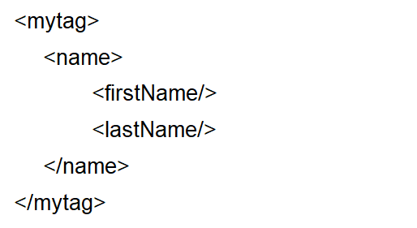
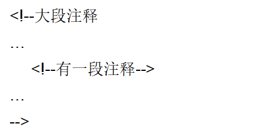
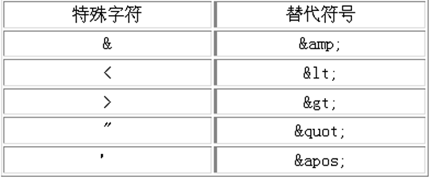

# xml

##     什么是XML

XML是指可扩展标记语言(eXtensible Markup Language)，它是一种标记语言，很类似HTML。它被设计的宗旨是传输数据，而非显示数据。

XML标签没有被预定义，需要用户自行定义标签。

XML技术是W3C组织(World Wide Web Consortium万维网联盟)发布的，目前遵循的是W3C组织于2000年发布的XML1.0规范。

XML被广泛认为是继之后在上最激动人心的新技术

##          XML文档的组成  

一个XML文件一般由以下几部分组成：

+   文档声明

+   元素

+   元素的属性

+   注释

+   CDATA区

+   特殊字符

+   处理指令(PI:Processing Instruction)

##      文档声明  

在编写XML文档时，需要先使用文档声明来声明XML文档。且必须出现在文档的第一行。

最简单的语法:<?xml version=“1.0”?>

用encoding属性说明文档所使用的字符编码，默认为UTF-8。保存在磁盘上的文件编码要与声明的编码一致。

 如：<?xml version="1.0" encoding="GB2312”?>

用standalone属性说明文档是否独立，即是否依赖其他文档。

 如：<?xml version="1.0" standalone="yes”?>

##      元素  

XML元素指XML文件中出现的标签。一个标签分为起始和结束标签(不能省略)。一个标签有如下几种书写形式：

-   包含标签主体：<mytag>some content</mytag>
-   不含标签主体：<mytag/>
-   一个标签中可以嵌套若干子标签，但所有标签必须合理的嵌套，不允许有交叉嵌套。
-   <mytag1><mytag2></mytag1></mytag2>  WRONG
-   一个XML文档必须有且仅有一个根标签，其他标签都是这个根标签的子标签或孙标签。

+   XML中不会忽略主体内容中出现的空格和换行。

    <small>注：由于在XML中，空格和换行都作为原始内容被处理，所以，在编写XML文件时，使用换行和缩进等方式来让原文件中的内容清晰可读的“良好”书写习惯可能要被迫改变。</small>

####      元素命名规范

元素(标签)的名称可以包含字母、数字、减号、下划线和英文句点，但必须遵守下面的一些规范：

-   严格区分大小写；
 

-   只能以字母或下划线开头；abc _abc
-   不能以xml(或XML、Xml等)开头----W3C保留日后使用；
-   名称字符之间不能有空格或制表符；ab
-   名称字符之间不能使用冒号； (有特殊用途)

##      元素的属性  

一个元素可以有多个属性，每个属性都有它自己的名称和取值，例如：<mytag name=“value” …/>

属性值一定要用引号(单引号或双引号)引起来。

属性名称的命名规范与元素的命名规范相同

元素中的属性是不允许重复的

在XML技术中，标签属性所代表的信息也可以被改成用子元素的形式来描述，例如：

##      注释

XML中的注释语法为：<!--这是注释-->

注意：

​	XML声明之前不能有注释

​	注释不能嵌套，例如：

##     CDATA区  

CDATA是Character Data的缩写

作用：把标签当做普通文本内容；

语法：<![CDATA[内容]]>

例：

​	<![CDATA[

​		 <itcast>www.baidu.com</itcast>

​	]]>

##     特殊字符  

对于一些特殊字符，若要在元素主体内容中显示，必须进行转义。

##     常用的约束技术  

-   XML DTD
-   XDR
-   SOX
-   XML Schema

###     DTD快速入门  

DTD(Document Type Definition)：文档类型定义。

作用：约束XML的书写规范

###     编程校验XML文档的正确性  

-   IE5以上浏览器内置了XML解析工具：Microsoft.XMLDOM，开发人员可以编写javascript代码，利用这个解析工具装载xml文件，并对xml文件进行dtd验证。

-   创建xml文档解析器对象

    ​	var xmldoc = new ActiveXObject("Microsoft.XMLDOM");

-   开启xml校验

    ​	xmldoc.validateOnParse = "true";

-   装载xml文档

    ​	xmldoc.load("book.xml");

-   获取错误信息

    ​	xmldoc.parseError.reason; 

    ​	xmldoc.parseError.line

###     编写DTD的方式  

DTD约束文档可以在XML文档中直接定义，也可以作为单独的文档进行编写(单独的文档必须以UTF-8编码进行保存) 。

在XML文档中编写DTD示例

<imgassets/image/image-20200216151900252.png" alt="image-20200216151900252" style="zoom: 80%;" />

###     引入外部DTD文档  

XML使用DOCTYPE声明语句来指明它所遵循的DTD文档，有两种形式：

+   当引用的DTD文档在本地时，采用如下方式：

      	<!DOCTYPE 根元素 SYSTEM “DTD文档路径">

    如：<!DOCTYPE 书架 SYSTEM “book.dtd">

+   当引用的DTD文档在公共网络上时，采用如下方式：

    ​	<!DOCTYPE 根元素 PUBLIC “DTD名称" “DTD文档的URL">

    如：<!DOCTYPE web-app PUBLIC 

    ​		 "-//Sun Microsystems, Inc.//DTD Web Application 2.3//EN"

    ​		 "http://java.sun.com/dtd/web-app_2_3.dtd">

###     DTD语法细节  

DTD文档的语法主要涉及以下内容的定义：

-   定义元素

-   定义属性

-   定义实体

###      DTD-定义元素

 在DTD文档中使用ELEMENT关键字来声明一个XML元素。

语法：<!ELEMENT 元素名称 使用规则>

+   使用规则：
    +   (#PCDATA):指示元素的主体内容只能是普通的文本.(Parsed Character Data)
    +   EMPTY：用于指示元素的主体为空。比如 
    +   ANY:用于指示元素的主体内容为任意类型。
    +   (子元素)：指示元素中包含的子元素

+   定义子元素及描述它们的关系:

    +   如果子元素用逗号分开，说明必须按照声明顺序去编写XML文档。

        ​	如: <!ELEMENT FILE (TITLE,AUTHOR,EMAIL)

    +  如果子元素用“|”分开，说明任选其一。

        ​      如:<!ELEMENT FILE (TITLE|AUTHOR|EMAIL)

    +  用+、*、？来表示元素出现的次数

       + 如果元素后面没有+*?:表示必须且只能出现一次

       + +:表示至少出现一次，一次或多次

       + *：表示可有可无，零次、一次或多次

       + ?:表示可以有也可以无，有的话只能有一次。零次或一次

    +  如： <!ELEMENT MYFILE ((TITLE*, AUTHOR?, EMAIL)* | COMMENT)>

###     DTD--定义属性

在DTD文档中使用ATTLIST关键字来为一个元素声明属性。

语法：

​      <!ATTLIST 元素名

​      属性名1 属性值类型 设置说明

​      属性名2 属性值类型 设置说明

​      …

​     \>

属性值类型：

+ CDATA：表示属性的取值为普通的文本字符串

+ ENUMERATED (DTD没有此关键字)：表示枚举，只能从枚举列表中任选其一，如(鸡肉|牛肉|猪肉|鱼肉)

+ ID:表示属性的取值不能重复

设置说明

+ \#REQUIRED：表示该属性必须出现

+ \#IMPLIED：表示该属性可有可无

+ \#FIXED:表示属性的取值为一个固定值。语法：#FIXED "固定值"

+ 直接值：表示属性的取值为该默认值

###     DTD--定义实体  

定义实体就是为一段内容指定一个名称，使用时通过这个名称就可以引用其所代表的内容。

在DTD文档中使用ENTITY关键字来声明一个实体。

实体可分为：引用实体和参数实体，两者的语法不同

    ####     定义引用实体

概念：在DTD中定义，在XML中使用

语法：<!ENTITY 实体名称 “实体内容”>

引用方式（注意是在XML中使用）：&实体名称;

####     定义参数实体

概念：在DTD中定义，在DTD中使用

语法：<!ENTITY % 实体名称 “实体内容”>

引用方式（注意是在DTD中使用）：%实体名称;

##     Java解析XML概述  

XML解析方式分为两种：DOM方式和SAX方式

+ DOM：Document Object Model，文档对象模型。这种方式是W3C推荐的处理XML的一种方式。

+ SAX：Simple API for XML。这种方式不是官方标准，属于开源社区XML-DEV，几乎所有的XML解析器都支持它。

XML解析开发包

+ JAXP：是SUN公司推出的解析标准实现。

+ Dom4J：是开源组织推出的解析开发包。(牛，大家都在用，包括SUN公司的一些技术的实现都在用)

+ JDom：是开源组织推出的解析开发包。

##     JAXP  

JAXP:(Java API for XML Processing)开发包是JavaSE的一部分，它由以下几个包及其子包组成：

+ org.w3c.dom:提供DOM方式解析XML的标准接口

+ org.xml.sax:提供SAX方式解析XML的标准接口

+ javax.xml:提供了解析XML文档的类

javax.xml.parsers包中，定义了几个工厂类。我们可以通过调用这些工厂类，得到对XML文档进行解析的DOM和SAX解析器对象。

+ DocumentBuilderFactory

+ SAXParserFactory

##          使用JAXP进行DOM解析

javax.xml.parsers 包中的DocumentBuilderFactory用于创建DOM模式的解析器对象 ， DocumentBuilderFactory是一个抽象工厂类，它不能直接实例化，但该类提供了一个newInstance方法 ，这个方法会根据本地平台默认安装的解析器，自动创建一个工厂的对象并返回。

<assets/imagexml/image-20200216155402526.png" alt="image-20200216155402526" style="zoom:80%;" />

### 获得JAXP中的DOM解析器

调用 DocumentBuilderFactory.newInstance() 方法得到创建 DOM 解析器的工厂。

调用工厂对象的 newDocumentBuilder方法得到 DOM 解析器对象。

调用 DOM 解析器对象的 parse() 方法解析 XML 文档，得到代表整个文档的 Document 对象，进行可以利用DOM特性对整个XML文档进行操作了。

###     DOM编程

DOM模型(document object model)

+ DOM解析器在解析XML文档时，会把文档中的所有元素，按照其出现的层次关系，解析成一个个Node对象(节点)。

+ 在dom中，节点之间关系如下：

+ 位于一个节点之上的节点是该节点的父节点(parent)

+ 一个节点之下的节点是该节点的子节点（children） 

+ 同一层次，具有相同父节点的节点是兄弟节点（sibling） 

+ 一个节点的下一个层次的节点集合是节点后代(descendant)

+ 父、祖父节点及所有位于节点上面的，都是节点的祖先(ancestor) 

+ 节点类型

### Node对象

Node对象提供了一系列常量来代表结点的类型，当开发人员获得某个Node类型后，就可以把Node节点转换成相应的节点对象(Node的子类对象)，以便于调用其特有的方法。（查看API文档） 

Node对象提供了相应的方法去获得它的父结点或子结点。编程人员通过这些方法就可以读取整个XML文档的内容、或添加、修改、删除XML文档的内容了。

### DOM方式解析XML文件

DOM解析编程

+ 1、得到某个具体的节点内容

+ 2、遍历所有元素节点

+ 3、修改某个元素节点的主体内容

+ 4、向指定元素节点中增加子元素节点

+ 5、向指定元素节点上增加同级元素节点

+ 6、删除指定元素节点

+ 7、操作XML文件属性

### 更新XML文档

javax.xml.transform包中的Transformer类用于把代表XML文件的Document对象转换为某种格式后进行输出，例如把xml文件应用样式表后转成一个html文档。利用这个对象，当然也可以把Document对象又重新写入到一个XML文件中。

Transformer类通过transform方法完成转换操作，该方法接收一个源和一个目的地。我们可以通过：

javax.xml.transform.dom.DOMSource类来关联要转换的document对象， 

用javax.xml.transform.stream.StreamResult 对象来表示数据的目的地。

 Transformer对象通过TransformerFactory获得。

###SAX解析

在使用 DOM 解析 XML 文档时，需要读取整个 XML 文档，在内存中构架代表整个 DOM 树的Doucment对象，从而再对XML文档进行操作。此种情况下，如果 XML 文档特别大，就会消耗计算机的大量内存，并且容易导致内存溢出。

SAX解析允许在读取文档的时候，即对文档进行处理，而不必等到整个文档装载完才会文档进行操作。

SAX采用事件处理的方式解析XML文件，利用 SAX 解析 XML 文档，涉及两个部分：解析器和事件处理器：

+ 解析器可以使用JAXP的API创建，创建出SAX解析器后，就可以指定解析器去解析某个XML文档。

+ 解析器采用SAX方式在解析某个XML文档时，它只要解析到XML文档的一个组成部分，都会去调用事件处理器的一个方法，解析器在调用事件处理器的方法时，会把当前解析到的xml文件内容作为方法的参数传递给事件处理器。

+ 事件处理器由程序员编写，程序员通过事件处理器中方法的参数，就可以很轻松地得到sax解析器解析到的数据，从而可以决定如何对数据进行处理。
assets/imagec="xml/image-20200216155859043.png" alt="image-20200216155859043" style="zoom:80%;" />

### SAX方式解析XML文档

-   使用SAXParserFactory创建SAX解析工厂

    ​	SAXParserFactory spf = SAXParserFactory.newInstance();

-   通过SAX解析工厂得到解析器对象 

    ​	SAXParser sp = spf.newSAXParser();

-   通过解析器对象得到一个XML的读取器

    ​	XMLReader xmlReader = sp.getXMLReader();

-   设置读取器的事件处理器 

    ​	xmlReader.setContentHandler(new BookParserHandler());

-   解析xml文件 

    ​	xmlReader.parse("book.xml");使用SAXParserFactory创建SAX解析工厂

    ​	SAXParserFactory spf = SAXParserFactory.newInstance();

-   通过SAX解析工厂得到解析器对象 

    ​	SAXParser sp = spf.newSAXParser();

-   通过解析器对象得到一个XML的读取器

    ​	XMLReader xmlReader = sp.getXMLReader();

-   设置读取器的事件处理器 

    ​	xmlReader.setContentHandler(new BookParserHandler());

-   解析xml文件 

    ​	xmlReader.parse("book.xml");

### PULL解析

//得到解析器XMLPullParser

 XmlPullParser parser = XmlPullParserFactory.newInstance().newPullParser();

 //设置要读取的文件

 //以字节流的形式输入内容。编码要与xml中声明的编码保持一致

 InputStream in = new FileInputStream("src/a.xml");

 parser.setInput(in, "UTF-8");

 //得到读取到的某部分的类型

 int evenType = parser.getEventType();

 //判断：需要的内容搞出来

 while(evenType!=XmlPullParser.END_DOCUMENT){

​	 if(evenType==XmlPullParser.START_DOCUMENT){

​		 System.out.println("文档的开始");

 	}

​	 if(evenType==XmlPullParser.START_TAG){

​		 System.out.println("标签的开始");

 	}

 	if(evenType==XmlPullParser.TEXT){

​		 System.out.println("文本内容");

 	}

​	 if(evenType==XmlPullParser.END_TAG){

 		System.out.println("标签的结束");

​	 }

 	//让解析器的游标往下移动

​	 evenType = parser.next();

 }

### DOM4J解析XML文档

Dom4j是一个简单、灵活的开放源代码的库。Dom4j是由早期开发JDOM的人分离出来而后独立开发的。与JDOM不同的是，dom4j使用接口和抽象基类，虽然Dom4j的API相对要复杂一些，但它提供了比JDOM更好的灵活性。 

Dom4j是一个非常优秀的Java XML API，具有性能优异、功能强大和极易使用的特点。现在很多软件采用的Dom4j，例如Hibernate，包括sun公司自己的JAXM也用了Dom4j。

使用Dom4j开发，需下载dom4j相应的jar文件。

### Document对象

DOM4j中，获得Document对象的方式有三种：

 1.读取XML文件,获得document对象      

​          SAXReader reader = new SAXReader();
​        Document  document = reader.read(new File("input.xml"));

 2.解析XML形式的文本,得到document对象.

​          String text = "<members></members>";
​        Document document = DocumentHelper.parseText(text);

 3.主动创建document对象.

​         Document document = DocumentHelper.createDocument();
​      		 //创建根节点

​         Element root = document.addElement("members");

### 节点对象

1.获取文档的根节点.

   Element root = document.getRootElement();

2.取得某个节点的子节点.

 Element element=node.element(“书名");

3.取得节点的文字

   String text=node.getText();

4.取得某节点下所有名为“member”的子节点，并进行遍历.
 		 List nodes = rootElm.elements("member");
 		 for (Iterator it = nodes.iterator(); it.hasNext();) {
 			  Element elm = (Element) it.next();
   			// do something
 		 }

5.对某节点下的所有子节点进行遍历.
  		 for(Iterator it=root.elementIterator();it.hasNext();){
   		 Element element = (Element) it.next();
   		 // do something
   		}

6.在某节点下添加子节点.
		 Element ageElm = newMemberElm.addElement("age");

7.设置节点文字.
 		element.setText("29");

8.删除某节点.
		 //childElm是待删除的节点,parentElm是其父节点

  parentElm.remove(childElm);

9.添加一个CDATA节点.
 		Element contentElm = infoElm.addElement("content");
		 contentElm.addCDATA(diary.getContent());

###     **节点对象属性**  

1.取得某节点下的某属性
   		Element root=document.getRootElement();  
   		//属性名name

​    Attribute attribute=root.attribute("size");

2.取得属性的文字
   		String text=attribute.getText();

 3.删除某属性
 		Attribute attribute=root.attribute("size");
 		root.remove(attribute);

3.遍历某节点的所有属性
  		Element root=document.getRootElement();  
  		 for(Iterator it=root.attributeIterator();it.hasNext();){
    		 Attribute attribute = (Attribute) it.next();
   		  String text=attribute.getText();
   		  System.out.println(text);
  		 }

4.设置某节点的属性和文字.
  		newMemberElm.addAttribute("name", "sitinspring");

5.设置属性的文字
  		Attribute attribute=root.attribute("name");
  		attribute.setText("sitinspring");

### 将文档写入XML文件

1.文档中全为英文,不设置编码,直接写入的形式.
  		XMLWriter writer = new XMLWriter(new FileWriter("output.xml"));
 		 writer.write(document);
 		 writer.close();

2.文档中含有中文,设置编码格式写入的形式.
		 OutputFormat format = OutputFormat.createPrettyPrint();
		 // 指定XML编码          

   format.setEncoding("GBK");    
			 XMLWriter writer = new XMLWriter(new FileOutputStream ("output.xml"),format);
 			writer.write(document);
			 writer.close();

####     Dom4j在指定位置插入节点   

1.得到插入位置的节点列表（list）

2.调用list.add(index,elemnent)，由index决定element的插入位置。

Element元素可以通过DocumentHelper对象得到。示例代码：

Element aaa = DocumentHelper.*createElement*("aaa");

aaa.setText("aaa");

List list = root.element("书").elements();

list.add(1, aaa);

//更新document

####     字符串与XML的转换  

1.将字符串转化为XML

   String text = "<members> <member>sitinspring</member></members>";
 		 Document document = DocumentHelper.parseText(text);

2.将文档或节点的XML转化为字符串.

   SAXReader reader = new SAXReader();
 		 Document  document = reader.read(new File("input.xml"));      
		  Element root=document.getRootElement();        
 		 String docXmlText=document.asXML();
		  String rootXmlText=root.asXML();
  		Element memberElm=root.element("member");
 		 String memberXmlText=memberElm.asXML();

###     **XML Schema**  

XML Schema 也是一种用于定义和描述 XML 文档结构与内容的模式语言，其出现是为了克服 DTD 的局限性

XML Schema VS DTD：

+ XML Schema符合XML语法结构。 

+ DOM、SAX等XML API很容易解析出XML Schema文档中的内容。 

+ XML Schema对**名称空间**支持得非常好。 

+ XML Schema比XML DTD支持更多的数据类型，并支持用户自定义新的数据类型。 

+ XML Schema定义约束的能力非常强大，可以对XML实例文档作出细致的语义限制。

+ XML Schema不能像DTD一样定义实体，比DTD更复杂，但Xml Schema现在已是w3c组织的标准，它正逐步取代DTD。 

XML Schema 文件自身就是一个XML文件，但它的扩展名通常为.xsd。

一个XML Schema文档通常称之为**模式文档**(约束文档)，遵循这个文档书写的xml文件称之为**实例文档**。

和XML文件一样，一个XML Schema文档也必须有一个根结点，但这个根结点的名称为schema。

编写了一个XML Schema约束文档后，通常需要把这个文件中声明的元素绑定到一个ＵＲＩ地址上，在XML Schema技术中有一个专业术语来描述这个过程，即把XML Schema文档声明的元素绑定到一个**名称空间**上，以后XML文件就可以通过这个URI（即名称空间）来告诉解析引擎，xml文档中编写的元素来自哪里，被谁约束。

###     **名称空间的概念**   

在XML Schema中，每个约束模式文档都可以被赋以一个唯一的名称空间，名称空间用一个唯一的URI（Uniform Resource Identifier，统一资源标识符）表示。 在Xml文件中书写标签时，可以通过名称空间声明（xmlns），来声明当前编写的标签来自哪个Schema约束文档。如：

<itcast:书架 xmlns:itcast=“http://www.itcast.cn”>

 	itcast:书……/itcast:书

 < /itcast:书架>

​    <small> 注意：名称空间的名字语法容易让人混淆，尽管以 http:// 开始，那个 URL 并不指向一个包含模式定义的文件。事实上，这个 URL：http://www.itcast.cn根本没有指向任何文件，只是一个分配的名字  </small>

###     使用名称空间引入Schema

为了在一个XML文档中声明它所遵循的Schema文件的具体位置，通常需要在Xml文档中的根结点中使用schemaLocation属性来指定，例如：

 <itcast:书架 xmlns:itcast="http://www.itcast.cn"

 xmlns:xsi="http://www.w3.org/2001/XMLSchema-instance"

 xsi:schemaLocation=“http://www.itcast.cn book.xsd">

schemaLocation此属性有两个值。第一个值是需要使用的命名空间。第二个值是供命名空间使用的 XML schema 的位置，两者之间用空格分隔。

注意，在使用schemaLocation属性时，也需要指定该属性来自哪里。