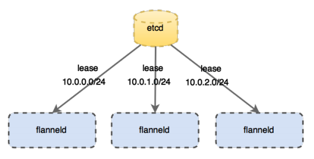
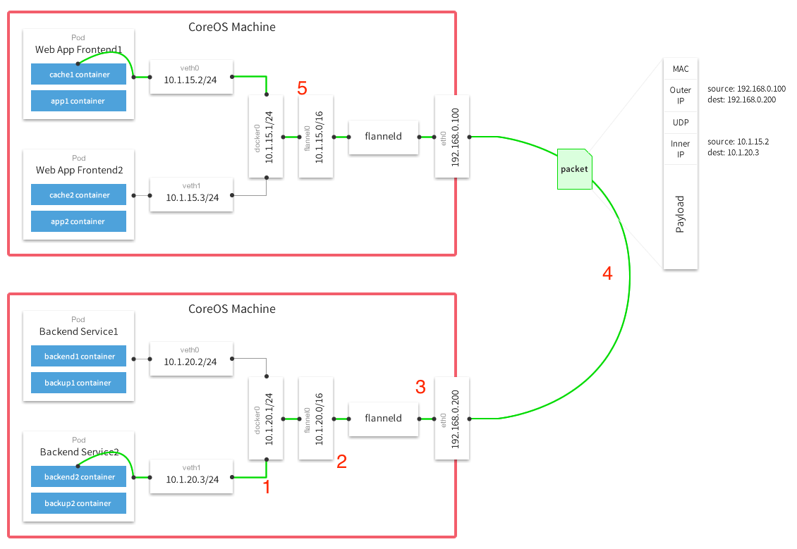

# flannel 网络架构

flannel 是一个中心化的 overlay 容器网络，设计简单，容易理解，对于 k8s 来说，有一个假设：所有容器都可以和集群里任意其他容器或者节点通信，并且通信双方看到的对方的 IP 地址就是实际的地址，主要的好处就是不需要任何的端口映射和地址转换，拥有一张扁平的网络更容易管理，而且由于是基于 Etcd 的中心化的管理，所以对于一些 IP 变化异常频繁的场景来说，比一些去中心化的方案能够较及时同步网络拓扑关系。

## IP 地址的管理

flannel 的 IP 地址是通过 Etcd 管理的，在 k8s 初始化的时候指定 pod 大网的网段 `--pod-network-cidr=10.244.0.0/16`，flanneld 可以直接通过 Etcd 管理，如果启动的时候指定了 `--kube-subnet-mgr`，可以直接通过 k8s 的 apiserver 来获得一个小网段的租期，通过 `kubectl get <NodeName> -o jsonpath='{.spec.podCIDR}'` 可以获取对应节点的 CIDR 表示的网段，flannel 是以节点为单元划分小网段的，每个节点上的 pod 在这个例子当中是划分一个 10.244.x.0/24 的网段，所以总共能分配 255 个节点，每个节点上可以分配 253 个 pod。结构如下图所示，每个节点上都会有一个 flanneld 用于管理自己网段的租期。



可以通过在 host 上 `cat /run/flannel/subnet.env` 查看同步下来的信息，例如：

```
FLANNEL_NETWORK=10.244.0.0/16
FLANNEL_SUBNET=10.244.0.1/24
FLANNEL_MTU=8951
FLANNEL_IPMASQ=true
```

说明当前节点分配的网段是 `10.244.0.1/24`。在每个节点上因为已经确定了网段，用 ipam 就可以管理这一范围 ip 地址的分配，所以本身 pod 的 IP 分配和中心 Etcd 没有太多联系。

## 基本工作原理

简单来说就是通过建立 VXLAN 隧道，通过 UDP 把 IP 封装一层直接送到对应的节点，实现了一个大的 VLAN。没有使用 IPoIP 或者 GRE 主要是因为一些云厂商比如 AWS 的安全策略只能支持 TCP/UDP/ICMP。

flannel 本身会创建一个类似下面这样配置的 CNI bridge 设备。

```json
{
    "name" : "cni0",
    "type" : "bridge",
    "mtu" : 8973,
    "ipMasq" : true,
    "isGateway" : true,
    "ipam" : {
        "type" : "host-local",
        "subnet" : "10.244.0.1/24",
         "routes" : [ { "dst" : "10.244.0.0/16" } ]
    }
}
```

具体的网络拓扑图如下，所用的网段开头是 10.1，但是划分是一致的，图里面的 docker0 应该是 cni0，flannel0 应该是 flannel.1，这个命名的区别主要是不带点的是 UDP 封装，带点的是 vxlan 封装，图片比较早。

第一步，首先是从容器中(10.1.20.3)出来，走桥接去到 cni0 (10.1.20.1)，通过`brctl show` 可以看到 `cni0` 接了两个容器的 veth。

第二步，然后根据路由规则，在宿主机上能够用`ip route`，找到一条走到大网段的路由。`10.15.0.0/16 dev flannel.1`，到达 `flannel.1`。

第三步，`flannel.1` 会走 vxlan，这个是在内核实现的，如果用 UDP 封装就是在用户态实现的，用户态实现的等于把包从内核过了两遍，没有直接用 vxlan 封装的直接走内核效率高，所以基本上不会使用 UDP 封装。对应的 vxlan 配置可以通过 `bridge fdb flannel.1` 看到，没有一条隧道就会有一条这样的转发表。因为到达每个对应网段的信息是在 Etcd 上分配的 flannel.1 只要 watch 然后发现有更改的时候对应配置隧道指向对应容器网段的宿主机 IP 就可以。

```
8a:55:a7:e2:e9:18 dev flannel.1 dst 192.168.0.100 self permanent
```

第四步，走宿主机的网络到达对端，对端的 vxlan 收到以后会拆开封装，丢到协议栈里面。

第五步，根据路由 `ip route`，中的一条`10.1.15.0/24 dev cni0 proto kernel scope link src 10.1.15.1`，送到 `cni0` 然后再转发给容器 `10.1.15.2`, 最后就能完成 pod 跨界点的互通了。

## 优缺点

因为整个的网段分配是存在 Etcd 里面的，节点只要 watch 然后根据网段建隧道就可以，相对来说中心化的系统设计比较简单，而且对于 IP 地址变动能够及时反应，特别是节点和容器都有剧烈变化的时候（别问我为啥物理节点会有剧烈变化，创业公司玩法怎么省钱怎么来……），相比于去中心化的一些设计能够更快同步一些。当然建隧道是一个点对点的规模，也就是如果有 n 个节点建隧道的话，每个节点上都要建 n-1 条隧道。

一种改进方式是使用 host-gw 的后端方式，以及 ipvlan，不过目前 ipvlan 还没有支持，[这里](http://machinezone.github.io/research/networking-solutions-for-kubernetes/)有一个各种后端实现的比较，vxlan 表现很最差，host-gw 的做法是不用隧道的方式，而是把路由信息直接写到节点上，直接打平到节点上，等于是节点之间是一个大网，每个节点上的小网段通过路由的方式和大网互通，将到达各个节点的网段的路由刷到节点上，而不是建 vxlan 隧道的方式，比如文中的例子，会有这样的路由。

```
10.1.15.0/24 via 192.168.0.100 dev eth0 
10.1.15.0/24 dev cni0  proto kernel  scope link  src 10.1.20.1
```

然而，由于 flannel 只能够修改各个主机的路由表，一旦主机直接隔了个其他路由设备，比如三层路由器，这个包就会在路由设备上被丢掉。这样一来，host-gw 的模式就只能用于二层直接可达的网络。