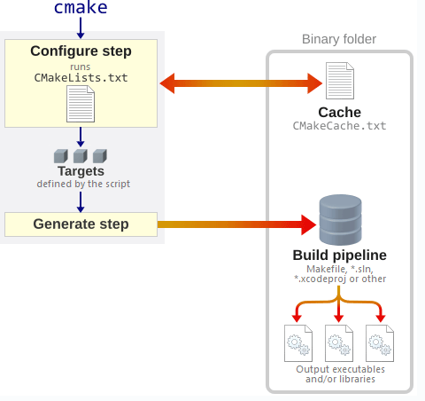

# CMake

## CMakeLists.txt 文件

CMakeLists.txt 是 CMake 的配置文件，用于定义项目的构建规则、依赖关系、编译选项等。
每个 CMake 项目通常都有一个或多个 CMakeLists.txt 文件。

## 文件结构和基本语法

CMakeLists.txt 文件使用一系列的 CMake 指令来描述构建过程。常见的指令包括：

```bash
# 指定 CMake 的最低版本要求
# cmake_minimum_required(VERSION <version>)
cmake_minimum_required(VERSION 3.10)

# 定义项目的名称和使用的编程语言
# project(<project_name> [<language>...])
project(MyProject CXX)

# 指定要生成的可执行文件和其源文件
# add_executable(<target> <source_files>...)
add_executable(MyExecutable main.cpp other_file.cpp)

# 创建一个库（静态库或动态库）及其源文件
# add_library(<target> <source_files>...)
add_library(MyLibrary STATIC library.cpp)

# 链接目标文件与其他库
# target_link_libraries(<target> <libraries>...)
target_link_libraries(MyExecutable MyLibrary)

# 添加头文件搜索路径
# include_directories(<dirs>...)
include_directories(${PROJECT_SOURCE_DIR}/include)

# 设置变量的值
# set(<variable> <value>...)
set(CMAKE_CXX_STANDARD 11)

# 设置目标属性
# target_include_directories(TARGET target_name [BEFORE | AFTER] [SYSTEM] [PUBLIC | PRIVATE | INTERFACE] [items1...])
target_include_directories(MyExecutable PRIVATE ${PROJECT_SOURCE_DIR}/include)

# 安装规则
# install(TARGETS target1 [target2 ...][RUNTIME DESTINATION dir][LIBRARY DESTINATION dir]
# [ARCHIVE DESTINATION dir][INCLUDES DESTINATION [dir ...]][PRIVATE_HEADER DESTINATION dir][PUBLIC_HEADER DESTINATION dir])
install(TARGETS MyExecutable RUNTIME DESTINATION bin)

# 条件语句 (if, elseif, else, endif 命令)
if(expression)
  # Commands
elseif(expression)
  # Commands
else()
  # Commands
endif()

# 自定义命令 (add_custom_command 命令)
add_custom_command(
   TARGET target
   PRE_BUILD | PRE_LINK | POST_BUILD
   COMMAND command1 [ARGS] [WORKING_DIRECTORY dir]
   [COMMAND command2 [ARGS]]
   [DEPENDS [depend1 [depend2 ...]]]
   [COMMENT comment]
   [VERBATIM]
)


# 定义变量
set(MY_VAR "Hello World")

# 使用变量
message(STATUS "Variable MY_VAR is ${MY_VAR}")

# 定义缓存变量
set(MY_CACHE_VAR "DefaultValue" CACHE STRING "A cache variable")

# 使用缓存变量
message(STATUS "Cache variable MY_CACHE_VAR is ${MY_CACHE_VAR}")

# 自动检测和配置外部库和包
find_package(Boost REQUIRED)
# 指定版本
find_package(Boost 1.70 REQUIRED)
# 查找库并指定路径
find_package(OpenCV REQUIRED PATHS /path/to/opencv)
# 使用查找到的库
target_link_libraries(MyExecutable Boost::Boost)
# 设置包含目录和链接目录
include_directories(${Boost_INCLUDE_DIRS})
link_directories(${Boost_LIBRARY_DIRS})

```

## 构建流程

1. 创建构建目录：保持源代码目录整洁。
2. 使用 CMake 生成构建文件：配置项目并生成适合平台的构建文件。
3. 编译和构建：使用生成的构建文件执行编译和构建。
4. 清理构建文件：删除中间文件和目标文件。
5. 重新配置和构建：处理项目设置的更改。



### 创建构建目录

```bash
mkdir build
cd build
```

### 生成构建文件

在构建目录中运行 CMake，以生成适合当前平台的构建系统文件（例如 Makefile、Ninja 构建文件、Visual Studio 工程文件等）。
运行 CMake 配置：在构建目录中运行 CMake 命令，指定源代码目录。源代码目录是包含 CMakeLists.txt 文件的目录。

```bash
cmake ..

# 如果需要指定生成器（如 Ninja、Visual Studio），可以使用 -G 选项
cmake -G "Ninja" ..

# 如果需要指定构建类型（如 Debug 或 Release），可以使用 -DCMAKE_BUILD_TYPE 选项
cmake -DCMAKE_BUILD_TYPE=Release ..

```

检查配置结果：CMake 会输出配置过程中的详细信息，包括找到的库、定义的选项等，如果没有错误，构建系统文件将被生成到构建目录中。

### 编译和构建

使用 Makefile（或类似构建系统）：如果使用 Makefile，可以运行 make 命令来编译和构建项目。

```bash
make
# 如果要构建特定的目标，可以指定目标名称
make MyExecutable

```

### 清理构建文件

构建过程中生成的中间文件和目标文件可以通过清理操作删除。

```bash
make clean

# 手动删除
rm -rf build/*

# 重新配置和构建
cmake ..
make

```

### 实例

```bash
cmake_minimum_required(VERSION 3.10)   # 指定最低 CMake 版本

project(MyProject VERSION 1.0)          # 定义项目名称和版本

# 设置 C++ 标准为 C++11
set(CMAKE_CXX_STANDARD 11)
set(CMAKE_CXX_STANDARD_REQUIRED ON)

# 添加头文件搜索路径
include_directories(${PROJECT_SOURCE_DIR}/include)

# 添加源文件
add_library(MyLib src/mylib.cpp)        # 创建一个库目标 MyLib
add_executable(MyExecutable src/main.cpp)  # 创建一个可执行文件目标 MyExecutable

# 链接库到可执行文件
target_link_libraries(MyExecutable MyLib)


mkdir build
cd build
cmake ..
make
./MyExecutable
make clean
rm -rf build/*
```