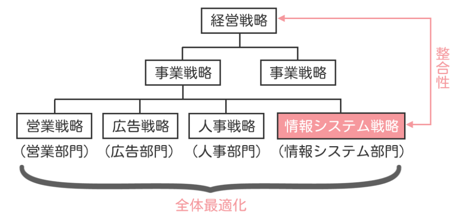

# 情報システム戦略

## 情報システム戦略の目的と考え方

    経営戦略に沿って効果的な情報システム戦略を策定すること，
    情報システム戦略に基づいて情報システム化基本計画を策定すること，
    情報システム戦略遂行のための組織体制などを理解する。

情報システム戦略とは、経営戦略を実現するために、いかに情報システムを構築・活用するかという戦略です。なお、情報システム戦略の最終責任者はCIO（最高情報責任者）となります。

情報システム戦略のイメージとしては、まず経営戦略を実現するためにそれぞれの事業部ごとの事業戦略を策定します。そして、事業戦略を実現するために各部門において機能別戦略を策定しますが、このうち、情報システム部門で策定される戦略が情報システム戦略となります。

- 経営戦略の例：世界的なグローバル企業を目指す

- 事業戦略の例：海外に出店して支配的シェア獲得

- 機能別戦略の例：研究開発戦略、購買戦略、生産戦略、物流戦略、商品戦略、広告戦略、営業戦略、人事戦略、情報システム戦略など

### 情報システム戦略立案時のポイント

#### 1. 現状の把握とあるべき姿の設定

情報システムは、自社の経営戦略や事業戦略を実現することを目的に構築されるものです。したがって、例えば特定の部門にとって都合のいいようなシステムを構築するのではなく、組織としての情報システム全体の最適化を目指すことが情報システム戦略策定の主な目的となります。

#### 2. 経営戦略との整合性を図る

繰り返しになりますが、情報システム戦略は経営戦略を実現するための戦略です。どれだけ素晴らしいシステムが出来上がったとしても、経営戦略を実現するために何の役にも立たないようなシステムでは意味がありません。情報システム戦略の立案にあたっては、必ず経営戦略や事業戦略との整合性を図る必要があります。

#### 3. 現状の把握とあるべき姿の設定

目標を立てるためには、まず現状の把握とあるべき姿の設定が大事です。

## 情報システム戦略の策定手順

情報システム戦略を策定する際の手順を理解する。

［タスクの例］ 
+ **対象領域ビジネスのプロセスレベルでの理解**

    情報システム戦略の策定において、まず対象となるビジネス領域のプロセスを深く理解することが必要です。このステップでは、ビジネスプロセスの流れや主要な業務活動、関与する部門や担当者などを把握します。これにより、情報システムがサポートすべき具体的なビジネスニーズを明確にできます。

+ **現行業務(As-Is)の調査・分析**

    次に、現行業務の状況を詳細に調査・分析します。As-Isの状態を把握することで、現在の業務プロセスやフロー、使用しているシステムの特性や課題を明確にします。この調査には、業務フロー図やヒアリング、観察などの方法が用いられます。

+ **情報システム(As-Is)の調査・分析**

    現行業務の調査に続いて、現在使用している情報システムの状況を調査・分析します。これには、システムの機能、性能、ユーザー満足度、システムの運用コストなどが含まれます。既存システムの強みと弱みを評価することで、改善が必要な領域を特定します。

+ **IT 動向の調査・分析**

    次に、最新のIT動向を調査・分析します。これには、技術の進展や市場の変化、業界のベストプラクティスなどが含まれます。クラウドコンピューティング、人工知能（AI）、ビッグデータ、IoT（Internet of Things）など、最新技術の適用可能性を評価し、戦略に反映します。

+ **基本戦略の策定**

    調査・分析結果を基に、情報システム戦略の基本方針を策定します。この段階では、全体的な戦略目標とアプローチを明確にします。基本戦略には、システムの統合化、プロセスの自動化、データの一元管理などが含まれることがあります。

+ **業務の新全体像（To-Be）と投資対象の選定**

    次に、将来の業務の新全体像（To-Be）を設計します。これは、As-Isの状態から改善された理想的な業務フローやシステム構成を示します。また、この段階で投資対象を選定し、どのシステムやプロジェクトに投資するかを決定します。

+ **情報システム戦略展開における活動・成果指標の設定**

    情報システム戦略を展開するための具体的な活動と、それに伴う成果指標（KPI）を設定します。これにより、戦略の実行状況をモニタリングし、必要に応じて調整を行います。成果指標には、プロジェクトの進捗、コスト削減効果、業務効率の向上などが含まれます。

+ **情報システム戦略の策定と承認**

    最後に、情報システム戦略を正式に策定し、組織の上層部からの承認を得ます。承認を得るためには、戦略の目的、具体的な計画、期待される効果などを明確に示し、関係者の理解と支持を得ることが重要です。

