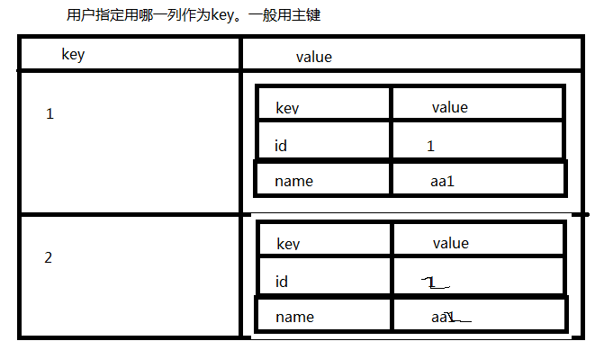
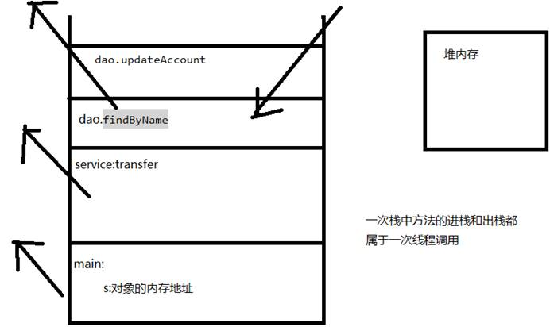

# 一、数据库有关的框架

1、框架：提高开发效率。按部就班

2、数据库框架：

ORM：Object Relation Mapping 对象关系映射。JavaBean---Object 数据库---->Relation

知名框架：Hibernate、MyBatis、JPA（Java Persist API：JavaEE技术之一，ORM标准）

 

DBUtils、Spring JDBCTemplate 不能算是ORM框架，只是对JDBC编码进行简化处理

# 二、DBUtils框架

QueryRunner

1、构造方法：

QueryRunner():默认构造方法

QueryRunner(DataSource ds):需要一个数据源

2、具体方法：

l batch：批处理

**[batch]((java.sql.Connection, java.lang.String, java.lang.Object[][]))**([Connection]() conn, [String]() sql, [Object]()[][] params):使用默认构造方法时

**[batch]((java.lang.String, java.lang.Object[][]))**([String]() sql, [Object]()[][] params):

Object[][]params:高维：执行的语句的条数 低维：每条语句需要的参数

 

l query：查询

**<T> T [query]((java.lang.String, org.apache.commons.dbutils.ResultSetHandler, java.lang.Object...))**([String]() sql, [ResultSetHandler]()<T> rsh, [Object]()... params)

**[query]((java.lang.String, org.apache.commons.dbutils.ResultSetHandler, java.lang.Object...))**(Connection conn,[String]() sql, [ResultSetHandler]()<T> rsh, [Object]()... params)

 

l update：DML INSERT UPDATE DELETE

**[update]((java.lang.String, java.lang.Object...))**([String]() sql, [Object]()... params)

**[update]((java.lang.String, java.lang.Object...))**([Connection]() conn,[String]() sql, [Object]()... params)

 

 

注意：多次调用update方法，需要在一个事务中，用这个**[update]((java.lang.String, java.lang.Object...))**([Connection]() conn,[String]() sql, [Object]()... params)，用默认的构造方法时。

 

# 三、DBUtils所有的结果处理器

封装的结果是什么样的：

[ArrayHandler]()：适用于结果集只有一条结果的情况。返回Obejct[],数组中的元素就是记录的每列数据。

[ArrayListHandler]()：适用于结果集中有多条结果的情况。返回的是一个List<Object[]>,List封装了记录，Object[]每条记录的每列数据。

[BeanHandler](), [BeanListHandler](),

[ColumnListHandler]():适用于取某一列的值。返回的是List<Object>，集合中就是该列中的数据。

[KeyedHandler]():适用于结果中有多条的情况。返回的是一个Map<Object,Map<String,Object>>。

[MapHandler]():适用于结果只有一条的情况。Map<String,Object>,key是字段名，value，字段值。

[MapListHandler]()：适用于结果有多条的情况。List<Map<String,Object>>.List封装了所有的记录，每条记录封装到Map中,key是字段名，value，字段值。

 

[ScalarHandler]()：适用于结果中只有一行和只有一列的情况。返回的是一个Object。

 

# 四、利用DBUtils进行事务有关的操作

学习Spring AOP，看看

# 五、ThreadLocal(很重要)

1、模拟ThreadLocal功能的伪代码

public class ThreadLocal{

//容器:key,当前线程对象

private Map<Runnable,Object> map = new HashMap<Runnable,Object>();

public void set(Object value){//向Map中存数据

map.put(Thread.currentThread(),value);

}

public Object get(){//从Map中取数据

return map.get(Thread.currentThread());

}

public void remove(){

map.remove(Thread.currentThread());

}

}

特点：一个线程放的东西，除了自己谁也拿不到。线程局部变量。

2、线程中的方法调用栈

# 六、利用DBUtils进行多表的操作

 