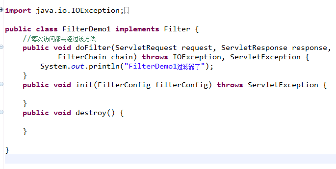
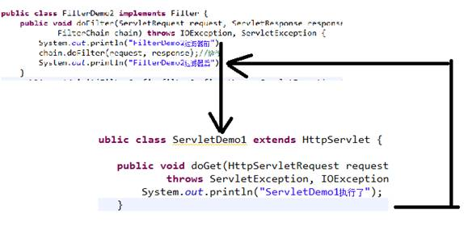
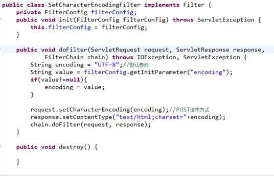
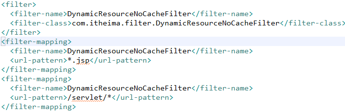
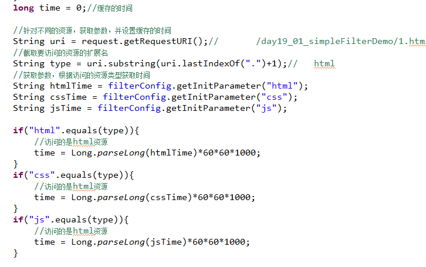
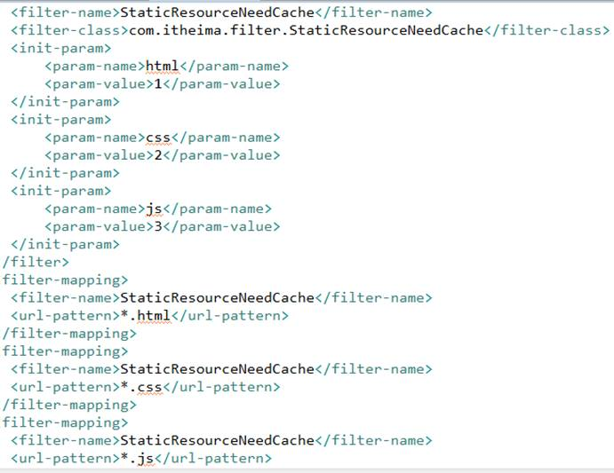
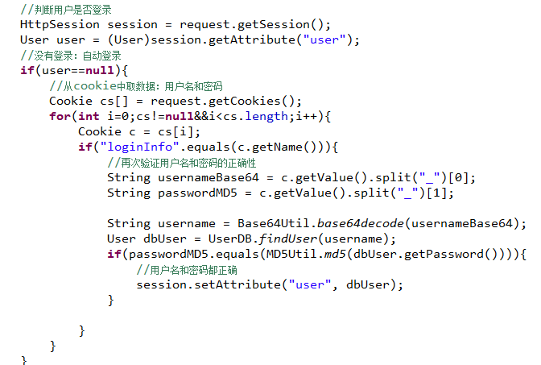

# 一、什么是过滤器及它的作用

1、过滤器的作用好比一个保安，是Servlet规范中的技术

2、用户在访问应用的资源之前或之后，可以对请求和响应做出一定的处理

 

# 二、编写过滤器的步骤

1、编写一个类，实现javax.servlet.Filter接口

2、配置过滤哪些资源

修改web.xml,配置要过滤器的资源的映射地址

3、让目标资源执行，放行

# 三、过滤器的生命周期

1、过滤器的实例由服务器创建的，其中的方法也是由服务器调用的

2、过滤器在应用被加载时实例化并初始化（调用init方法），只有一次；用户每次访问过滤范围之内的资源，过滤器的doFIlter方法都会执行；应用被卸载或服务器停止时会调用销毁方法（destroy）。

3、特点：过滤器中的实例变量，注意线程安全问题；

# 四、过滤器的过滤顺序

责任链设计模式

多个过滤器的代码执行顺序

总结：多个过滤器过滤相同的资源，过滤顺序按照web.xml中filter-mapping的出现顺序依次进行过滤的。

 

# 专题：Servlet VS. Filter

1、Servlet能做的过滤器都能做；过滤器比Servlet多了一个是否放行的功能。

2、Servlet在开发中是作为控制器来用的；Filter也可以作为控制器来用。

3、Struts1框架：Servlet作为控制器

Struts2框架：FIlter作为控制器（Struts2框架）

 

# 五、过滤器的简单案例：4

1、解决POST请求参数和响应输出的编码过滤器

2、动态资源不要缓存过滤器

3、控制静态资源的缓存时间

 

# 专题：Base64编码（很重要）

1、原理：3字节变为4字节（计算机中存储的都是字节）

2、编码原理：

1010 0101   1110 0100   1001 1111  3个字节

0010 1001   0001 1110   0001 0010   0001 1111 4个字节

 

每个字节表示的范围：00000000~0011111

表示的整数范围：0~63。每一个整数都对应着键盘上的一个可见字符

3、Base64是一个码表

可以把任何的二进制转变为可见字符串（A~Za~z0-9+/）

 

 

 

 

4、自动登录过滤器

 

# 六、过滤器的高级配置

# 七、巩固装饰设计模式

1、定义一个类实现与被包装类相同的接口

2、定义一个变量，引用被包装类的实例

3、定义构造方法，传入被包装类实例

4、对于要改变的方法，改写即可

5、对于不需要改变的方法，调用被包装类原有的方法

# 过滤器的高级案例：4

# 国际化（了解）