# kubernetes的基础与创建

## 一、简介

### 1、Kubernetes 是什么

Kubernetes 是一个全新的基于容器技术的分布式架构解决方案，是 Google 开源的一个容器集群管理系统，Kubernetes 简称 K8S。

Kubernetes 是一个一站式的完备的分布式系统开发和支撑平台，更是一个开放平台，对现有的编程语言、编程框架、中间件没有任何侵入性。

Kubernetes 提供了完善的管理工具，这些工具涵盖了开发、部署测试、运维监控在内的各个环节。

Kubernetes 具有完备的集群管理能力，包括多层次的安全防护和准入机制、多租户应用支撑能力、透明的服务注册和服务发现机制、内建智能负载均衡器、强大的故障发现和自我修复能力、服务滚动升级和在线扩容能力、可扩展的资源自动调度机制、多粒度的资源配额管理能力。

Kubernetes 官方文档：https://kubernetes.io/zh/

### 2、Kubernetes 特性

① 自我修复

在节点故障时，重新启动失败的容器，替换和重新部署，保证预期的副本数量；杀死健康检查失败的容器，并且在未准备好之前不会处理用户的请求，确保线上服务不中断。

② 弹性伸缩

使用命令、UI或者基于CPU使用情况自动快速扩容和缩容应用程序实例，保证应用业务高峰并发时的高可用性；业务低峰时回收资源，以最小成本运行服务。

③ 自动部署和回滚

K8S采用滚动更新策略更新应用，一次更新一个Pod，而不是同时删除所有Pod，如果更新过程中出现问题，将回滚更改，确保升级不影响业务。

④ 服务发现和负载均衡

K8S为多个容器提供一个统一访问入口（内部IP地址和一个DNS名称），并且负载均衡关联的所有容器，使得用户无需考虑容器IP问题。

⑤ 机密和配置管理

管理机密数据和应用程序配置，而不需要把敏感数据暴露在镜像里，提高敏感数据安全性。并可以将一些常用的配置存储在K8S中，方便应用程序使用。

⑥ 存储编排

挂载外部存储系统，无论是来自本地存储，公有云，还是网络存储，都作为集群资源的一部分使用，极大提高存储使用灵活性。

⑦ 批处理

提供一次性任务，定时任务；满足批量数据处理和分析的场景。

## 二、集群架构与组件

Kubernetes 集群架构以及相关的核心组件如下图所示：一个 Kubernetes 集群一般包含一个 Master 节点和多个 Node 节点，一个节点可以看成是一台物理机或虚拟机。


### 1、Master Node

Master 是 K8S 的集群控制节点，每个 K8S 集群里需要有至少一个 Master 节点来负责整个集群的管理和控制，基本上 K8S 所有的控制命令都是发给它，它来负责具体的执行过程。Master 节点通常会占据一个独立的服务器，因为它太重要了，如果它不可用，那么所有的控制命令都将失效。

关键组件：

① **apiserver**

是集群的统一入口，各组件协调者，以 HTTP Rest 提供接口服务，所有对象资源的增、删、改、查和监听操作都交给 apiserver 处理后再提交给 Etcd 存储。

负责接收请求，解析请求，处理请求。

② **controller-manager**

控制器管理器，负责监控每一个控制器是健康的，他本身是高可用的，是冗余的。假如Master是三个节点，那么Master每一个上面都有一个控制器管理器，大家都在的时候这三个控制器管理器只有一个正常工作，他是主节点，其他都是做冗余的。

是 K8S 里所有资源对象的自动化控制中心，处理集群中常规后台任务，一个资源对应一个控制器，而 controller-manager 就是负责管理这些控制器的。如果APIServer做的是前台的工作的话，那么controller manager就是负责后台的。

③ **scheduler**

根据调度算法为新创建的 Pod 选择一个 Node 节点，可以任意部署，可以部署在同一个节点上，也可以部署在不同的节点上。

调度器，调度容器创建的请求，负责去观测每一个node之上总共可用的CPU，RAM和存储资源并根据用户所请求创建容器的资源量(因为在k8s上我们可以设定容器的资源上限和资源下限我们成为资源请求量)，调度器就是根据容器的最低需求，来进行评估，哪一个节点最合适。因此k8s设定了一个两级调度的方式来完成调度，第一步先做预选（先评估一下到底有多少个是符合这个容器运行需求的节点，比如有三个）。第二步要做优选，从这三者中在选择一个最佳适配，到底哪个是最佳取决于调度算法当中的优选算法来决定的。

④ **etcd**

是一个分布式的，一致的 key-value 存储，主要用途是共享配置和服务发现，保存集群状态数据，比如 Pod、Service 等对象信息。

### 2、Node

除了 Master，K8S 集群中的其它机器被称为 Node 节点，Node 节点是 K8S 集群中的工作负载节点，每个 Node 都会被 Master 分配一些工作负载，当某个 Node 宕机时，其上的工作负载会被 Master 自动转移到其它节点上去。

每个 Node 节点上都运行着以下关键组件：

① **kubelet**

kubelet 是 Master 在 Node 节点上的 Agent(代理)，与 Master 密切协作，管理本机运行容器的生命周期，负责 Pod 对应的容器的创建、启停等任务，实现集群管理的基本功能。集群代理，用于能够与master通信的，接收master和调度过来的各种任务执行，是保证容器始终处于健康运行状态的软件。简单来讲API Server把任务编排以后由Scheduler来调度，Scheduler的调度结果由kubelet来执行。比如启动pod、在本地上管理pod健康、创建存储卷等等都由kubelet来执行，但是kubelet本身并不能运行容器，他最多就能接收任务，并在本机上试图启动容器，运行容器就需要容器引擎来运行，最流行的引擎就是docke，是用于pod中的容器的而创建的。

② **kube-proxy**

在 Node 节点上实现 Pod 网络代理，实现 Kubernetes Service 的通信，维护网络规则和四层负载均衡工作。

③ **docker engine** ：主要概念Pod

Docker 引擎，负责本机的容器创建和管理工作。

Node 节点可以在运行期间动态增加到 K8S 集群中，前提是这个节点上已经正确安装、配置和启动了上述关键组件。在默认情况下 kubelet 会向 Master 注册自己，一旦 Node 被纳入集群管理范围，kubelet 就会定时向 Master 节点汇报自身的情况，例如操作系统、Docker 版本、机器的 CPU 和内存情况，以及之前有哪些 Pod 在运行等，这样 Master 可以获知每个 Node 的资源使用情况，并实现高效均衡的资源调度策略。而某个 Node 超过指定时间不上报信息时，会被 Master 判定为“失联”，Node 的状态被标记为不可用（Not Ready），随后 Master 会触发“工作负载大转移”的自动流程。

1.24版本已经将docker移除了，后面要用需要和其他容器一样配置

## 三、核心概念

###**1、Pod**

Pod 是 K8S 中最重要也是最基本的概念，Pod 是最小的部署单元，是一组容器的集合。其可以理解为容器的外壳，给容器做了一层抽象的封装，pod是k8s系统之上最小的调度的逻辑单元，他的内部主要是用来放容器的。每个 Pod 都由一个特殊的根容器 Pause 容器，以及一个或多个紧密相关的用户业务容器组成。

Pause 容器作为 Pod 的根容器，以它的状态代表整个容器组的状态。K8S 为每个 Pod 都分配了唯一的 IP 地址，称之为 Pod IP。Pod 里的多个业务容器共享 Pause 容器的IP，共享 Pause 容器挂载的 Volume。

pod工作特点：一个pod内可以包含多个容器，多个容器共享同一个底层的网络命名空间Net(网络设备、网络栈、端口等)，UTS（主机名和域名）和IPC（信号量、消息队列和共享内存）三个网络名称空间，另外三个互相隔离User、MNT、PID是互相隔离的。

所以说pod对外更像是一个模拟虚拟机，而且同一个pod下的容器还共享存储卷，存储卷就不在属于容器而属于pod。各个node主要是运行pod的，一般说一个pod只放一个容器，除非容器之间有非常紧密的关系需要放在同一个pod中，通常以中的一个容器为主容器，其他的容器是辅助这个主容器中的应用程序完成更多功能来实现的。其他的辅助容器也成为 边车（sidecar）。

我们为pod打上标签，用标签来识别pod，能让控制器或者是人能够基于标签的值来识别出pod的，比如我们创建了4个nginx pod，我们可以给每一个pod上加上一个标签叫app这个叫key，他的值都等于nginx，当我们想挑出来这些pod的时候就找key是app的并且值是nginx的就ok了。标签不是pod独有的，因为k8s是restfull风格的api，几乎所有被操纵的目标都是对象，几乎所有的对象都可以拥有标签，可以用标签选择器操作。

按管理方式看有两种Pod，一种是野生的，自己管自己，无法调度；一种是家养的，由控制器管控生命周期。

###**2、Label**

标签，附加到某个资源上，用于关联对象、查询和筛选。一个 Label 是一个 key=value 的键值对，key 与 value 由用户自己指定。Label 可以附加到各种资源上，一个资源对象可以定义任意数量的 Label，同一个 Label 也可以被添加到任意数量的资源上。

我们可以通过给指定的资源对象捆绑一个或多个不同的 Label 来实现多维度的资源分组管理功能，以便于灵活、方便地进行资源分配、调度、配置、部署等工作。

K8S 通过 Label Selector（标签选择器）来查询和筛选拥有某些 Label 的资源对象。Label Selector 有基于等式（ name=label1 ）和基于集合（ name in (label1, label2) ）的两种方式。

###**3、ReplicaSet（RC）**

ReplicaSet 用来确保预期的 Pod 副本数量，如果有过多的 Pod 副本在运行，系统就会停掉一些 Pod，否则系统就会再自动创建一些 Pod。

我们很少单独使用 ReplicaSet，它主要被 Deployment 这个更高层的资源对象使用，从而形成一整套 Pod 创建、删除、更新的编排机制。

###**4、Deployment** <font size=2 color=red>用的最多</font>

Deployment 用于部署无状态应用，Deployment 为 Pod 和 ReplicaSet 提供声明式更新，只需要在 Deployment 描述想要的目标状态，Deployment 就会将 Pod 和 ReplicaSet 的实际状态改变到目标状态。只能负责管理那些无状态的应用，还支持二级控制器叫HPA

###**5、Horizontal Pod Autoscaler（HPA）**

HPA 为 Pod 横向自动扩容，也是 K8S 的一种资源对象。HPA 通过追踪分析 RC 的所有目标 Pod 的负载变化情况，来确定是否需要针对性调整目标 Pod 的副本数量。可自动进行扩展

###**6、Service**

Service 定义了一个服务的访问入口，通过 Label Selector 与 Pod 副本集群之间“无缝对接”，定义了一组 Pod 的访问策略，防止 Pod 失联。

创建 Service 时，K8S会自动为它分配一个全局唯一的虚拟 IP 地址，即 Cluster IP。服务发现就是通过 Service 的 Name 和 Service 的 ClusterIP 地址做一个 DNS 域名映射来解决的。

<font color="red">DNS应该是来给Pod提供指向Service，然后再由Service转向其他Pod</font>

<span style="background-color:yellow;">一个节点有多个Serivice，一类Pod对应一个Service</span>

#### 为什么需要Service

云原生，指的就是快速扩缩容，适应动态变化等，这样的机制就会使得pod的IP不是固定的，每次重启，都会变动

由于pod对应的IP容易变动，因为pod的重启，其IP就会和原来不同，如果相关联服务，采用pod IP，那每次pod 重启就需要修改使用此服务的IP

因此 k8s Service 提供了一个稳定访问的机制，提供稳定的IP

#### service是怎么管理pod的呢？

pod的ip地址经常变，主机名也经常变，但是pod上有固定的元数据叫标签label，只要创建了pod的label是统一的，都能被service识别，因为service是靠标签选择器来关联pod对象的。所以只要pod存在，只要属于这个标签选择器，那么就会立即被service挑选住，并作为service的后端组件。而后这个service把这个pod关联进来后在动态探测这个pod的ip地址是什么，端口是什么，并作为自己调度的后端可用服务器主机对象。客户端的请求到达service，并由service代理至客户端pod来实现。因此客户端始终看见的都是service的地址。

而在k8s之上，service不是应用程序，也不是一个实体组件，他只不过是一个iptables的DNAT规则(目标地址转换)。因为是个规则，所以service的地址是没有配置在任何一个网卡上的，是不存在的，他仅仅出现在规则中，所以ping不通的，但是却可以请求做服务端。能ping通是因为有一个TCP/IP协议栈有支持这个ip地址，所以他能在协议栈上进行响应。

service作为k8s的对象来讲，有service的名称，而service名称就相当于这个服务的名称，而名称可以被解析，可以直接把service名称解析为service的ip，名称解析靠DNS，所以我们装完k8s集群以后，第一件事就需要在k8s集群之上部署一个DNS Pod，已确保各service域名能被解析，像这样的pod是k8s自身就需要用到的，所以我们把它成为基础性的系统架构的pod对象，而且他们也被称为集群的附件AddOns。
###**7、Namespace**

命名空间，Namespace 多用于实现多租户的资源隔离。Namespace 通过将集群内部的资源对象“分配”到不同的Namespace中，形成逻辑上分组的不同项目、小组或用户组。

K8S 集群在启动后，会创建一个名为 default 的 Namespace，如果不特别指明 Namespace，创建的 Pod、RC、Service 都将被创建到 default 下。

当我们给每个租户创建一个 Namespace 来实现多租户的资源隔离时，还可以结合 K8S 的资源配额管理，限定不同租户能占用的资源，例如 CPU 使用量、内存使用量等。

## 四、集群搭建 —— 平台规划

### 常见部署方案

+   传统的部署方式：二进制  

    ​	让k8s自己的相关组件统统运行为系统级的守护进程，这包括master节点上的四个组件，以及每个node节点上的三个组件，都运行为系统级守护进程，但是这种安装方式每一组都需要我们手动解决，包括做证书等等，而安装过程也需要我们手动解决，编辑配置文件也需要手动解决，他的配置过程繁琐而复杂，一般第一次部署需要一天左右的时间能调通。但是在较大集群的恢复速度上具有优势。

    

+   **kubeadm**

    ​	这个工具是k8s官方的集群部署管理工具，几个命令就能完成安装，但是他把所有组件能运行为容器的全部运行为容器，只有kubelet是需要单独装在主机上的，其他统统运行为容器。这些容器的所有的镜像都托管在gcr的仓库当中，<font color=red><del>gcr的仓库出于某种不可描述的原因(国内访问不了) ，是不能直接访问的</del></font>。  实现一种自我管理的方式把k8s自己也部署为pod (至少核心组件部署为pod)，包括master和各node所在内的所有节点，我们还需要手动部署kubelet和docker就行了。因为docker是运行容器的引擎，kubelet是负责运行pod化容器的核心组件。每一个节点都装kubelet和docker后运行容器及运行pod的基础环境我们已经准备好了。

    ​	在此基础之上我们能够实现把master的相关四个组件统统运行为pod，就是直接托管在k8s之上，而后把每个node节点上的余下的组件叫kube-proxy也运行为pod，那整个集群就跑起来了。要注意以上说的这些pod都是静态pod（static pod，不受k8s的管理，只不过运行为pod的形式而已）而不是我们之前讲过的能够接受k8s自身管理的pod。我们的flannel也是需要托管的，每一个节点包括master和各node节点还需要部署flannel，以支撑他们部署的pod资源彼此之间能够互相通信的。但是这个flannel的的确确是托管在k8s集群之上的附件，他不像前面那几个都是静态的pod，都是动态的由k8s自身管理的pod。

    #### **总结一下使用kubeadm安装k8s**：

    1.  在master、nodes节点安装kubelet，kubeadm，docker
    2.  在master节点上去运行 kubeadm init去初始化集群
    3.  各nodes节点上分别执行kubeadm join加入到集群中

### 1、生产环境 K8S 平台规划

K8S 环境有两种架构方式，单 Master 集群和多 Master 集群，将先搭建起单 Master 集群，再扩展为多 Master 集群。开发、测试环境可以部署单 Master 集群，生产环境为了保证高可用需部署多 Master 集群。

**① 单 Master 集群架构**

单 Master 集群架构相比于多 Master 集群架构无法保证集群的高可用，因为 master 节点一旦宕机就无法进行集群的管理工作了。单 master 集群主要包含一台 Master 节点，及多个 Node 工作节点、多个 Etcd 数据库节点。

Etcd 是 K8S 集群的数据库，可以安装在任何地方，也可以与 Master 节点在同一台机器上，只要 K8S 能连通 Etcd。


**② 多 Master 集群架构**

多 Master 集群能保证集群的高可用，相比单 Master 架构，需要一个额外的负载均衡器来负载多个 Master 节点，Node 节点从连接 Master 改成连接 LB 负载均衡器。


**③ 集群规划**

为了测试，我在本地使用 VMware 创建了几个虚拟机（可通过克隆快速创建虚拟机），一个虚拟机代表一台独立的服务器。


K8S 集群规划如下：

生产环境建议至少两台 Master 节点，LB 主备各一个节点；至少两台以上 Node 节点，根据实际运行的容器数量调整；Etcd 数据库可直接部署在 Master 和 Node 的节点，机器比较充足的话，可以部署在单独的节点上。


**④ 服务器硬件配置推荐**

测试环境与生产环境服务器配置推荐如下，本地虚拟机的配置将按照本地测试环境的配置来创建虚拟机。

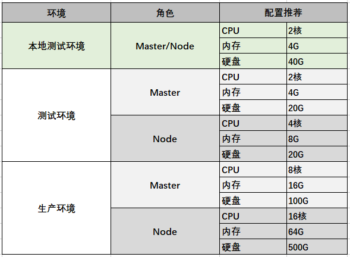


### 2、操作系统初始化

接下来将基于二进制包的方式，手动部署每个组件，来组成 K8S 高可用集群。通过手动部署每个组件，一步步熟悉每个组件的配置、组件之间的通信等，深层次的理解和掌握 K8S。

首先做的是每台服务器的配置初始化，依次按如下步骤初始化。

① 关闭防火墙

```
systemctl stop firewalld
systemctl disable firewalld
```

② 关闭 selinux

```
# #临时生效
setenforce 0
# #永久生效
sed -i 's/enforcing/disabled/' /etc/selinux/config
```

③ 关闭 swap，禁用交换分区。为了保证 kubelet 正常工作，你 **必须** 禁用交换分区

```
# #临时关闭
swapoff -a
# 永久生效
# vim /etc/fstab# #将 [UUID=5b59fd54-eaad-41d6-90b2-ce28ac65dd81 swap swap defaults 0 0] 这一行注释掉
```

④ 添加 hosts

```
# vim /etc/hosts

192.168.31.24 k8s-master-1
192.168.31.26 k8s-master-2
192.168.31.35 k8s-node-1
192.168.31.71 k8s-node-2
192.168.31.178 k8s-lb-master
192.168.31.224 k8s-lb-backup
```

⑤ 同步系统时间

各个节点之间需保持时间一致，因为自签证书是根据时间校验证书有效性，如果时间不一致，将校验不通过。如果不连接外网，以一台master为主时间，其他节点全部依赖这个节点的时间。

```
# #联网情况可使用如下命令
# ntpdate time.windows.com

# #如果不能联外网可使用 date 命令设置时间
```

## 五、集群搭建 —— 部署Etcd集群


### 1、自签证书

K8S 集群安装配置过程中，会使用各种证书，目的是为了加强集群安全性。K8S 提供了基于 CA 签名的双向数字证书认证方式和简单的基于 http base 或 token 的认证方式，其中 CA 证书方式的安全性最高。每个K8S集群都有一个集群根证书颁发机构（CA），集群中的组件通常使用CA来验证API server的证书，由API服务器验证kubelet客户端证书等。

证书生成操作可以在master节点上执行，证书只需要创建一次，以后在向集群中添加新节点时只要将证书拷贝到新节点上，并做一定的配置即可。下面就在 **k8s-master-1** 节点上来创建证书，详细的介绍也可以参考官方文档：[分发自签名-CA-证书](https://kubernetes.io/zh/docs/concepts/cluster-administration/certificates/#分发自签名-ca-证书)

① K8S 证书

如下是 K8S 各个组件需要使用的证书


② 准备 cfssl 工具

我是使用 cfssl 工具来生成证书，首先下载 cfssl 工具。依次执行如下命令：

```Shell
curl -L https://pkg.cfssl.org/R1.2/cfssl_linux-amd64 -o /usr/local/bin/cfssl
url -L https://pkg.cfssl.org/R1.2/cfssljson_linux-amd64 -o /usr/local/bin/cfssljson
curl -L https://pkg.cfssl.org/R1.2/cfssl-certinfo_linux-amd64 -o /usr/local/bin/cfssl-certinfo

chmod +x /usr/local/bin/cfssl*
```

### 2、自签 Etcd SSL 证书

我们首先为 **etcd** 签发一套SSL证书，通过如下命令创建几个目录，/k8s/etcd/ssl 用于存放 etcd 自签证书，/k8s/etcd/cfg 用于存放 etcd 配置文件，/k8s/etcd/bin 用于存放 etcd 执行程序。

```shell
cd /
mkdir -p /k8s/etcd/{ssl,cfg,bin}
```

进入 etcd 目录：

```shell
cd /k8s/etcd/ssl
```

① 创建 CA 配置文件：**ca-config.json**

执行如下命令创建 ca-config.json

```json
cat > ca-config.json <<EOF
{
  "signing": {
    "default": {
      "expiry": "87600h"
    },
    "profiles": {
      "etcd": {
        "usages": [
            "signing",
            "key encipherment",
            "server auth",
            "client auth"
        ],
        "expiry": "87600h"
      }
    }
  }
}
EOF
```

**说明：**

-   signing：表示该证书可用于签名其它证书；生成的 ca.pem 证书中 CA=TRUE；
-   profiles：可以定义多个 profiles，分别指定不同的过期时间、使用场景等参数；后续在签名证书时使用某个 profile；
-   expiry：证书过期时间
-   server auth：表示client可以用该 CA 对server提供的证书进行验证；
-   client auth：表示server可以用该CA对client提供的证书进行验证；

② 创建 CA 证书签名请求文件：**ca-csr.json**

执行如下命令创建 ca-csr.json：

```json
cat > ca-csr.json <<EOF
{
  "CN": "etcd",
  "key": {
    "algo": "rsa",
    "size": 2048
  },
  "names": [
    {
      "C": "CN",
      "ST": "Shanghai",
      "L": "Shanghai",
      "O": "etcd",
      "OU": "System"
    }
  ],
    "ca": {
       "expiry": "87600h"
    }
}
EOF
```

**说明：**

-   CN：Common Name，kube-apiserver 从证书中提取该字段作为请求的用户名 (User Name)；浏览器使用该字段验证网站是否合法；
-   key：加密算法
-   C：国家
-   ST：地区
-   L：城市
-   O：组织，kube-apiserver 从证书中提取该字段作为请求用户所属的组 (Group)；
-   OU：组织单位

③ 生成 CA 证书和私钥

```shell
cfssl gencert -initca ca-csr.json | cfssljson -bare ca #自建CA的命令
```


**说明：**

-   **ca-key.pem**：CA 私钥
-   **ca.pem**：CA 数字证书

④ 创建证书签名请求文件：**etcd-csr.json**

执行如下命令创建 etcd-csr.json：

```json
cat > etcd-csr.json <<EOF
{
    "CN": "etcd",
    "hosts": [
      "192.168.31.24",
      "192.168.31.35",
      "192.168.31.71"
    ],
    "key": {
        "algo": "rsa",
        "size": 2048
    },
    "names": [
        {
            "C": "CN",
            "ST": "BeiJing",
            "L": "BeiJing",
            "O": "etcd",
            "OU": "System"
        }
    ]
}
EOF
```

**说明：**

-   **hosts**：需要指定授权使用该证书的 IP 或域名列表，这里配置所有 etcd 的IP地址。
-   **key**：加密算法及长度
-   **names**: 创建给谁的，位置信息，功能无关性

⑤ 为 etcd 生成证书和私钥

```shell
#为ETCD颁发的证书和私钥
cfssl gencert -ca=ca.pem -ca-key=ca-key.pem -config=ca-config.json -profile=etcd etcd-csr.json | cfssljson -bare etcd
```

**说明：**

-   -ca：指定 CA 数字证书
-   -ca-key：指定 CA 私钥
-   -config：CA 配置文件
-   -profile：指定环境
-   -bare：指定证书名前缀

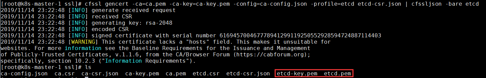

**说明：**

-   **etcd-key.pem**：etcd 私钥
-   **etcd.pem**：etcd 数字证书

证书生成完成，后面部署 Etcd 时主要会用到如下几个证书：


### 3、Etcd 数据库集群部署

etcd 集群采用主从架构模式（一主多从）部署，集群通过选举产生 leader，因此需要部署奇数个节点（3/5/7）才能正常工作。etcd使用raft一致性算法保证每个节点的一致性。


① 下载 etcd

从 github 上下载合适版本的 etcd

```shell
cd /k8s/etcd
wget https://github.com/etcd-io/etcd/releases/download/v3.2.28/etcd-v3.2.28-linux-amd64.tar.gz
```

解压,将 etcd 复制到 /usr/local/bin 下：

```shell
tar zxf etcd-v3.2.28-linux-amd64.tar.gz
cp etcd-v3.2.28-linux-amd64/{etcd,etcdctl} /k8s/etcd/bin
rm -rf etcd-v3.2.28-linux-amd64*
```

② 创建配置 etcd 配置文件：**etcd.conf**

```properties
cat > /k8s/etcd/cfg/etcd.conf <<EOF 
# [Member]
ETCD_NAME=etcd-1
ETCD_DATA_DIR=/k8s/data/default.etcd
ETCD_LISTEN_PEER_URLS=https://192.168.31.24:2380 
ETCD_LISTEN_CLIENT_URLS=https://192.168.31.24:2379
#注意端口2380指向的是其他ETCD，集群接口，端口2379指向Master等客户端

# [Clustering]
ETCD_INITIAL_ADVERTISE_PEER_URLS=https://192.168.31.24:2380
ETCD_ADVERTISE_CLIENT_URLS=https://192.168.31.24:2379
ETCD_INITIAL_CLUSTER=etcd-1=https://192.168.31.24:2380,etcd-2=https://192.168.31.35:2380,etcd-3=https://192.168.31.71:2380
ETCD_INITIAL_CLUSTER_TOKEN=etcd-cluster
ETCD_INITIAL_CLUSTER_STATE=new

# [security]
ETCD_CERT_FILE=/k8s/etcd/ssl/etcd.pem
ETCD_KEY_FILE=/k8s/etcd/ssl/etcd-key.pem
ETCD_TRUSTED_CA_FILE=/k8s/etcd/ssl/ca.pem
ETCD_PEER_CERT_FILE=/k8s/etcd/ssl/etcd.pem
ETCD_PEER_KEY_FILE=/k8s/etcd/ssl/etcd-key.pem
ETCD_PEER_TRUSTED_CA_FILE=/k8s/etcd/ssl/ca.pem
EOF
```

**说明：**

-   ETCD_NAME：etcd在集群中的唯一名称

-   ETCD_DATA_DIR：etcd数据存放目录

-   ETCD_LISTEN_PEER_URLS：etcd集群间通讯的地址，设置为本机IP

-   ETCD_LISTEN_CLIENT_URLS：客户端访问的地址，设置为本机IP

    

-   ETCD_INITIAL_ADVERTISE_PEER_URLS：初始集群通告地址，集群内部通讯地址，设置为本机IP

-   ETCD_ADVERTISE_CLIENT_URLS：客户端通告地址，设置为本机IP

-   ETCD_INITIAL_CLUSTER：集群节点地址，以 key=value 的形式添加各个 etcd 的地址

-   ETCD_INITIAL_CLUSTER_TOKEN：集群令牌，用于集群间做简单的认证

-   ETCD_INITIAL_CLUSTER_STATE：集群状态

    

-   ETCD_CERT_FILE：客户端 etcd 数字证书路径

-   ETCD_KEY_FILE：客户端 etcd 私钥路径

-   ETCD_TRUSTED_CA_FILE：客户端 CA 证书路径

-   ETCD_PEER_CERT_FILE：集群间通讯etcd数字证书路径

-   ETCD_PEER_KEY_FILE：集群间通讯etcd私钥路径

-   ETCD_PEER_TRUSTED_CA_FILE：集群间通讯CA证书路径

③ 创建 或修改 etcd 服务：**etcd.service**

通过EnvironmentFile指定 **etcd.conf** 作为环境配置文件

```sh
cat > /k8s/etcd/etcd.service <<'EOF'
[Unit]
Description=Etcd Server
After=network.target
After=network-online.target
Wants=network-online.target

[Service]
Type=notify
EnvironmentFile=/k8s/etcd/cfg/etcd.conf
WorkingDirectory=${ETCD_DATA_DIR}

ExecStart=/k8s/etcd/bin/etcd \
  --name=${ETCD_NAME} \
  --data-dir=${ETCD_DATA_DIR} \
  --listen-peer-urls=${ETCD_LISTEN_PEER_URLS} \
  --listen-client-urls=${ETCD_LISTEN_CLIENT_URLS},http://127.0.0.1:2379 \
  --initial-advertise-peer-urls=${ETCD_INITIAL_ADVERTISE_PEER_URLS} \
  --advertise-client-urls=${ETCD_ADVERTISE_CLIENT_URLS} \
  --initial-cluster=${ETCD_INITIAL_CLUSTER} \
  --initial-cluster-token=${ETCD_INITIAL_CLUSTER_TOKEN} \
  --initial-cluster-state=${ETCD_INITIAL_CLUSTER_STATE} \
  --cert-file=${ETCD_CERT_FILE} \
  --key-file=${ETCD_KEY_FILE} \
  --trusted-ca-file=${ETCD_TRUSTED_CA_FILE} \
  --peer-cert-file=${ETCD_PEER_CERT_FILE} \
  --peer-key-file=${ETCD_PEER_KEY_FILE} \
  --peer-trusted-ca-file=${ETCD_PEER_TRUSTED_CA_FILE}

Restart=on-failure
LimitNOFILE=65536

[Install]
WantedBy=multi-user.target
EOF
```

etcd.service 更多的配置以及说明可以通过如下命令查看：

```shell
/k8s/etcd/bin/etcd --help
```

④ 将 etcd 目录拷贝到另外两个节点

```sh
scp -r /k8s root@k8s-node-1:/k8s
scp -r /k8s root@k8s-node-2:/k8s
```


⑤ 修改两个节点配置文件

修改 k8s-node-1 节点的 /k8s/etcd/cfg/etcd.conf：

```properties
# [member]
ETCD_NAME=etcd-2
ETCD_LISTEN_PEER_URLS=https://192.168.31.35:2380
ETCD_LISTEN_CLIENT_URLS=https://192.168.31.35:2379

# [cluster]
ETCD_INITIAL_ADVERTISE_PEER_URLS=https://192.168.31.35:2380
ETCD_ADVERTISE_CLIENT_URLS=https://192.168.31.35:2379
```

修改 k8s-node-2 节点的 /k8s/etcd/cfg/etcd.conf：

```properties
# [member]
ETCD_NAME=etcd-2
ETCD_LISTEN_PEER_URLS=https://192.168.31.71:2380
ETCD_LISTEN_CLIENT_URLS=https://192.168.31.71:2379

# [cluster]
ETCD_INITIAL_ADVERTISE_PEER_URLS=https://192.168.31.71:2380
ETCD_ADVERTISE_CLIENT_URLS=https://192.168.31.71:2379
```

⑥ 启动 etcd 服务

首先在三个节点将 **etcd.service** 拷贝到 /usr/lib/systemd/system/ 下

```sh
cp /k8s/etcd/etcd.service /usr/lib/systemd/system/
systemctl daemon-reload
```

在三个节点启动 etcd 服务

```sh
systemctl start etcd
```

设置开机启动

```sh
systemctl enable etcd
```

查看 etcd 的日志

```sh
tail -f /var/log/messages
```


注意：如果日志中出现连接异常信息，请确认所有节点防火墙是否开放2379,2380端口，或者直接关闭防火墙。

查看 etcd 集群状态

```
/k8s/etcd/bin/etcdctl \
    --ca-file=/k8s/etcd/ssl/ca.pem \
    --cert-file=/k8s/etcd/ssl/etcd.pem \
    --key-file=/k8s/etcd/ssl/etcd-key.pem \
    --endpoints=https://192.168.31.24:2379,https://192.168.31.35:2379,https://192.168.31.71:2379 \
cluster-health
```

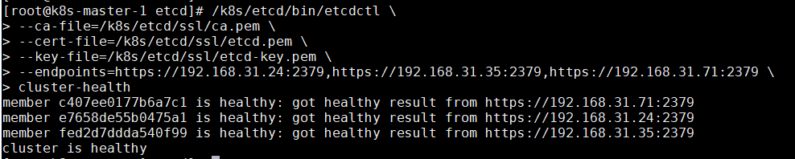

## 六、集群搭建 —— 部署Master组件

### 1、自签 ApiServer SSL 证书

K8S 集群中所有资源的访问和变更都是通过 kube-apiserver 的 REST API 来实现的，首先在 master 节点上部署 kube-apiserver 组件。

我们首先为 **apiserver** 签发一套SSL证书，过程与 etcd 自签SSL证书类似。通过如下命令创建几个目录，ssl 用于存放自签证书，cfg 用于存放配置文件，bin 用于存放执行程序，logs 存放日志文件。

```
cd /
mkdir -p /k8s/kubernetes/{ssl,cfg,bin,logs}
```

进入 kubernetes 目录：

```
cd /k8s/kubernetes/ssl
```

① 创建 CA 配置文件：**ca-config.json**

执行如下命令创建 ca-config.json

```json
cat > ca-config.json <<EOF
{
  "signing": {
    "default": {
      "expiry": "87600h"
    },
    "profiles": {
      "kubernetes": {
        "usages": [
            "signing",
            "key encipherment",
            "server auth",
            "client auth"
        ],
        "expiry": "87600h"
      }
    }
  }
}
EOF
```

② 创建 CA 证书签名请求文件：**ca-csr.json**

执行如下命令创建 ca-csr.json：

```json
cat > ca-csr.json <<EOF
{
  "CN": "kubernetes",
  "key": {
    "algo": "rsa",
    "size": 2048
  },
  "names": [
    {
      "C": "CN",
      "ST": "Shanghai",
      "L": "Shanghai",
      "O": "kubernetes",
      "OU": "System"
    }
  ],
    "ca": {
       "expiry": "87600h"
    }
}
EOF
```

③ 生成 CA 证书和私钥

```
cfssl gencert -initca ca-csr.json | cfssljson -bare ca
```

④ 创建证书签名请求文件：**kubernetes-csr.json**

执行如下命令创建 kubernetes-csr.json：

```json
cat > kubernetes-csr.json <<EOF
{
    "CN": "kubernetes",
    "hosts": [
      "127.0.0.1",
      "10.0.0.1",
      "192.168.31.24",
      "192.168.31.26",
      "192.168.31.35",
      "192.168.31.71",
      "192.168.31.26",
      "192.168.31.26",
      "kubernetes",
      "kubernetes.default",
      "kubernetes.default.svc",
      "kubernetes.default.svc.cluster",
      "kubernetes.default.svc.cluster.local"
    ],
    "key": {
        "algo": "rsa",
        "size": 2048
    },
    "names": [
        {
            "C": "CN",
            "ST": "BeiJing",
            "L": "BeiJing",
            "O": "kubernetes",
            "OU": "System"
        }
    ]
}
EOF
```

**说明：**

-   **hosts**：指定会直接访问 apiserver 的IP列表，一般需指定 etcd 集群、kubernetes master 集群的主机 IP 和 kubernetes 服务的服务 IP，Node 的IP一般不需要加入。

⑤ 为 kubernetes 生成证书和私钥

```sh
cfssl gencert -ca=ca.pem -ca-key=ca-key.pem -config=ca-config.json -profile=kubernetes kubernetes-csr.json | cfssljson -bare kubernetes
```

### 2、部署 kube-apiserver 组件

① 下载二进制包

通过 kubernetes Github 下载安装用的二进制包，教程这里使用 **[v1.16.2](https://github.com/kubernetes/kubernetes/releases)** 版本，server 二进制包已经包含了 master、node 上的各个组件，下载 server 二进制包即可。

将下载好的 kubernetes-v1.16.2-server-linux-amd64.tar.gz 上传到 /usr/local/src下，并解压：

```
tar -zxf kubernetes-v1.16.2-server-linux-amd64.tar.gz
```

先将 master 节点上部署的组件拷贝到 /k8s/kubernetes/bin 目录下：

```sh
cp -p /usr/local/src/kubernetes/server/bin/{kube-apiserver,kube-controller-manager,kube-scheduler} /k8s/kubernetes/bin/
#kube-apiserver,kube-controller-manager,kube-scheduler三个在1.25.0中是tar包，估计要再解压
cp -p /usr/local/src/kubernetes/server/bin/kubectl /usr/local/bin/
```

② 创建 Node 令牌文件：**token.csv**

Master apiserver 启用 TLS 认证后，Node节点 kubelet 组件想要加入集群，必须使用CA签发的有效证书才能与apiserver通信，当Node节点很多时，签署证书是一件很繁琐的事情，因此有了 TLS Bootstrap 机制，kubelet 会以一个低权限用户自动向 apiserver 申请证书，kubelet 的证书由 apiserver 动态签署。因此先为 apiserver 生成一个令牌文件，令牌之后会在 Node 中用到。

生成 token，一个随机字符串，可使用如下命令生成 token：apiserver 配置的 token 必须与 Node 节点 bootstrap.kubeconfig 配置保持一致。

```sh
head -c 16 /dev/urandom | od -An -t x | tr -d ' '
```

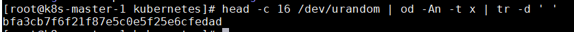

创建 token.csv，格式：token，用户，UID，用户组

```sh
cat > /k8s/kubernetes/cfg/token.csv <<'EOF'
bfa3cb7f6f21f87e5c0e5f25e6cfedad,kubelet-bootstrap,10001,"system:node-bootstrapper"
EOF
```

③ 创建 kube-apiserver 配置文件：**kube-apiserver.conf**

kube-apiserver 有很多配置项，可以参考官方文档查看每个配置项的用途：[kube-apiserver](https://kubernetes.io/zh/docs/reference/command-line-tools-reference/kube-apiserver/)

注意：踩的一个坑，“\” 后面不要有空格，不要有多余的换行，否则启动失败。

```sh
cat > /k8s/kubernetes/cfg/kube-apiserver.conf <<'EOF'
KUBE_APISERVER_OPTS="
  --etcd-servers=https://192.168.31.24:2379,https://192.168.31.35:2379,https://192.168.31.71:2379 \
  --bind-address=192.168.31.24 \
  --secure-port=6443 \
  --advertise-address=192.168.31.24 \
  --allow-privileged=true \	#是否使用管理员权限
  --service-cluster-ip-range=10.0.0.0/24 \
  --service-node-port-range=30000-32767 \
  --enable-admission-plugins=NamespaceLifecycle,LimitRanger,ServiceAccount,ResourceQuota,NodeRestriction \
  --authorization-mode=RBAC,Node \ #授权模式
  --enable-bootstrap-token-auth=true \ #基于token自动颁发证书
  --token-auth-file=/k8s/kubernetes/cfg/token.csv \ #自动颁发的用户配置
  --kubelet-client-certificate=/k8s/kubernetes/ssl/kubernetes.pem \
  --kubelet-client-key=/k8s/kubernetes/ssl/kubernetes-key.pem \
  --tls-cert-file=/k8s/kubernetes/ssl/kubernetes.pem \
  --tls-private-key-file=/k8s/kubernetes/ssl/kubernetes-key.pem \
  --client-ca-file=/k8s/kubernetes/ssl/ca.pem \
  --service-account-key-file=/k8s/kubernetes/ssl/ca-key.pem \
  --etcd-cafile=/k8s/etcd/ssl/ca.pem \
  --etcd-certfile=/k8s/etcd/ssl/etcd.pem \
  --etcd-keyfile=/k8s/etcd/ssl/etcd-key.pem \
  --v=2 \
  --logtostderr=false \  #错误信息是否打印，调试true
  --log-dir=/k8s/kubernetes/logs \  #日志的位置
  --audit-log-maxage=30 \
  --audit-log-maxbackup=3 \
  --audit-log-maxsize=100 \
  --audit-log-path=/k8s/kubernetes/logs/k8s-audit.log"
EOF
```

**重点配置说明：**

-   --etcd-servers：etcd 集群地址
-   --bind-address：apiserver 监听的地址，一般配主机IP
-   --secure-port：监听的端口
-   --advertise-address：集群通告地址，其它Node节点通过这个地址连接 apiserver，不配置则使用 --bind-address,**这两配置一样**
-   --service-cluster-ip-range：Service 的 虚拟IP范围，以CIDR格式标识，该IP范围不能与物理机的真实IP段有重合。
-   --service-node-port-range：Service 可映射的物理机端口范围，默认30000-32767
-   --admission-control：集群的准入控制设置，各控制模块以插件的形式依次生效，启用RBAC授权和节点自管理
-   --authorization-mode：授权模式，包括：AlwaysAllow，AlwaysDeny，ABAC(基于属性的访问控制)，Webhook，RBAC(基于角色的访问控制)，Node(专门授权由 kubelet 发出的API请求)。（默认值"AlwaysAllow"）。
-   --enable-bootstrap-token-auth：启用TLS bootstrap功能
-   --token-auth-file：这个文件将被用于通过令牌认证来保护API服务的安全端口。
-   --v：指定日志级别，0~8，越大日志越详细

④ 创建 apiserver 服务：**kube-apiserver.service**

```properties
cat > /usr/lib/systemd/system/kube-apiserver.service <<'EOF'
[Unit]
Description=Kubernetes API Server
Documentation=https://github.com/GoogleCloudPlatform/kubernetes
After=network.target

[Service]
EnvironmentFile=-/k8s/kubernetes/cfg/kube-apiserver.conf
ExecStart=/k8s/kubernetes/bin/kube-apiserver $KUBE_APISERVER_OPTS
Restart=on-failure
LimitNOFILE=65536

[Install]
WantedBy=multi-user.target
EOF
```

⑤ 启动 kube-apiserver 组件

启动组件

```sh
systemctl daemon-reload
systemctl start kube-apiserver
systemctl enable kube-apiserver
```

检查启动状态

```sh
systemctl status kube-apiserver.service
```

查看启动日志

```
less /k8s/kubernetes/logs/kube-apiserver.INFO
```

⑥ 将 kubelet-bootstrap 用户绑定到系统集群角色，之后便于 Node 使用token请求证书

```sh
kubectl create clusterrolebinding kubelet-bootstrap \
  --clusterrole=system:node-bootstrapper \
  --user=kubelet-bootstrap
```

### 3、部署 kube-controller-manager 组件

① 创建 kube-controller-manager 配置文件：**kube-controller-manager.conf**

详细的配置可参考官方文档：[kube-controller-manager](https://kubernetes.io/docs/reference/command-line-tools-reference/kube-controller-manager/)

```sh
cat > /k8s/kubernetes/cfg/kube-controller-manager.conf <<'EOF'
KUBE_CONTROLLER_MANAGER_OPTS="
  --leader-elect=true \
  --master=127.0.0.1:8080 \
  --address=127.0.0.1 \ #监听的IP地址
  --allocate-node-cidrs=true \ #要用fam
  --cluster-cidr=10.244.0.0/16 \
  --service-cluster-ip-range=10.0.0.0/24 \
  --cluster-signing-cert-file=/k8s/kubernetes/ssl/ca.pem \
  --cluster-signing-key-file=/k8s/kubernetes/ssl/ca-key.pem \
  --root-ca-file=/k8s/kubernetes/ssl/ca.pem \
  --service-account-private-key-file=/k8s/kubernetes/ssl/ca-key.pem \
  --experimental-cluster-signing-duration=87600h0m0s \
  --v=2 \
  --logtostderr=false \
  --log-dir=/k8s/kubernetes/logs"
EOF
```

**重点配置说明：**

-   --leader-elect：当该组件启动多个时，自动选举，默认true
-   --master：连接本地apiserver，apiserver 默认会监听本地8080端口
-   --allocate-node-cidrs：是否分配和设置Pod的CDIR
-   --service-cluster-ip-range：Service 集群IP段

② 创建 kube-controller-manager 服务：**kube-controller-manager.service**

```ini
cat > /usr/lib/systemd/system/kube-controller-manager.service <<'EOF'
[Unit]
Description=Kubernetes Controller Manager
Documentation=https://github.com/GoogleCloudPlatform/kubernetes
After=network.target

[Service]
EnvironmentFile=/k8s/kubernetes/cfg/kube-controller-manager.conf
ExecStart=/k8s/kubernetes/bin/kube-controller-manager $KUBE_CONTROLLER_MANAGER_OPTS
Restart=on-failure
LimitNOFILE=65536

[Install]
WantedBy=multi-user.target
EOF
```

③ 启动 kube-controller-manager 组件

启动组件

```sh
systemctl daemon-reload
systemctl start kube-controller-manager
systemctl enable kube-controller-manager
```

检查启动状态

```sh
systemctl status kube-controller-manager.service
```

查看启动日志

```sh
less /k8s/kubernetes/logs/kube-controller-manager.INFO
```

### 4、部署 kube-scheduler 组件

① 创建 kube-scheduler 配置文件：**kube-scheduler.conf**

```sh
cat > /k8s/kubernetes/cfg/kube-scheduler.conf <<'EOF'
KUBE_SCHEDULER_OPTS="
  --leader-elect=true \
  --master=127.0.0.1:8080 \
  --address=127.0.0.1 \
  --v=2 \
  --logtostderr=false \
  --log-dir=/k8s/kubernetes/logs"
EOF
```

② 创建 kube-scheduler 服务：**kube-scheduler.service**

```ini
cat > /usr/lib/systemd/system/kube-scheduler.service <<'EOF'
[Unit]
Description=Kubernetes Scheduler
Documentation=https://github.com/GoogleCloudPlatform/kubernetes
After=network.target

[Service]
EnvironmentFile=/k8s/kubernetes/cfg/kube-scheduler.conf
ExecStart=/k8s/kubernetes/bin/kube-scheduler $KUBE_SCHEDULER_OPTS
Restart=on-failure
LimitNOFILE=65536

[Install]
WantedBy=multi-user.target
EOF
```

③ 启动 kube-scheduler 组件

启动组件

```sh
systemctl daemon-reload
systemctl start kube-scheduler
systemctl enable kube-scheduler
```

查看启动状态

```sh
systemctl status kube-scheduler.service
```

查看启动日志

```sh
less /k8s/kubernetes/logs/kube-scheduler.INFO
less /k8s/kubernetes/logs/kube-scheduler.INFO
```

### 5、查看集群状态

① 查看组件状态

```sh
kubectl get cs
```

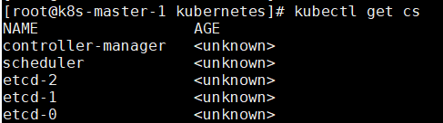

### 6、检查启动结果

```sh
ps aux | grep kube |wc -l
#一般正确结果为4
```


## 七、集群搭建 —— 部署Node组件

### 1、安装 Docker

借用的CentOS系统，注意docker的版本和K8s有兼容性

① 卸载旧版本

```sh
yum remove docker docker-common docker-selinux
```

② 安装依赖包

```shell
yum install -y yum-utils device-mapper-persistent-data lvm2
```

③ 安装 Docker 软件包源

```shell
yum-config-manager --add-repo https://download.docker.com/linux/centos/docker-ce.repo
```

④ 安装 Docker CE

```shell
yum install docker-ce
```

⑤ 启动 Docker 服务

```shell
systemctl start docker
```

⑥ 设置开机启动

```shell
systemctl enable docker
```

⑦ 验证安装是否成功

```shell
docker -v
docker info
```


### 2、Node 节点证书

① 创建 Node 节点的证书签名请求文件：**kube-proxy-csr.json**

首先在 k8s-master-1 节点上，通过颁发的 CA 证书先创建好 Node 节点要使用的证书，先创建证书签名请求文件：kube-proxy-csr.json：

```json
cat > kube-proxy-csr.json <<EOF
{
    "CN": "system:kube-proxy",
    "hosts": [],
    "key": {
        "algo": "rsa",
        "size": 2048
    },
    "names": [
        {
            "C": "CN",
            "ST": "BeiJing",
            "L": "BeiJing",
            "O": "kubernetes",
            "OU": "System"
        }
    ]
}
EOF
```

② 为 kube-proxy 生成证书和私钥

```shell
cfssl gencert -ca=ca.pem -ca-key=ca-key.pem -config=ca-config.json -profile=kubernetes kube-proxy-csr.json | cfssljson -bare kube-proxy
```

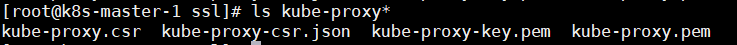

③ node 节点创建工作目录

在 k8s-node-1 节点上创建 k8s 目录

```shell
mkdir -p /k8s/kubernetes/{bin,cfg,logs,ssl}
```

④ 将 k8s-master-1 节点的文件拷贝到 node 节点

将 kubelet、kube-proxy 拷贝到 node 节点上：

```shell
scp -r /usr/local/src/kubernetes/server/bin/{kubelet,kube-proxy} root@k8s-node-1:/k8s/kubernetes/bin/
```

将证书拷贝到 k8s-node-1 节点上：

```shell
scp -r /k8s/kubernetes/ssl/{ca.pem,kube-proxy.pem,kube-proxy-key.pem} root@k8s-node-1:/k8s/kubernetes/ssl/
```

### 3、安装 kubelet

① 创建请求证书的配置文件：**bootstrap.kubeconfig**

bootstrap.kubeconfig 将用于向 apiserver 请求证书，apiserver 会验证 token、证书 是否有效，验证通过则自动颁发证书。

```yaml
cat > /k8s/kubernetes/cfg/bootstrap.kubeconfig <<'EOF'
apiVersion: v1
clusters:
- cluster: 
    certificate-authority: /k8s/kubernetes/ssl/ca.pem
    server: https://192.168.31.24:6443
  name: kubernetes
contexts:
- context:
    cluster: kubernetes
    user: kubelet-bootstrap
  name: default
current-context: default
kind: Config
preferences: {}
users:
- name: kubelet-bootstrap
  user:
    token: bfa3cb7f6f21f87e5c0e5f25e6cfedad
EOF
```

**说明：**

-   certificate-authority：CA 证书
-   server：master 地址
-   token：master 上 token.csv 中配置的 token

② 创建 kubelet 配置文件：**kubelet-config.yml**

为了安全性，kubelet 禁止匿名访问，必须授权才可以，通过 kubelet-config.yml 授权 apiserver 访问 kubelet。

```yaml
cat > /k8s/kubernetes/cfg/kubelet-config.yml <<'EOF'
kind: KubeletConfiguration
apiVersion: kubelet.config.k8s.io/v1beta1
address: 0.0.0.0
port: 10250
readOnlyPort: 10255
cgroupDriver: cgroupfs
clusterDNS:
- 10.0.0.2 
clusterDomain: cluster.local
failSwapOn: false
authentication:
  anonymous:
    enabled: false
  webhook:
    cacheTTL: 2m0s
    enabled: true
  x509: 
    clientCAFile: /k8s/kubernetes/ssl/ca.pem
authorization:
  mode: Webhook
  webhook:
    cacheAuthroizedTTL: 5m0s
    cacheUnauthorizedTTL: 30s
evictionHard:
  imagefs.available: 15%
  memory.available: 100Mi
  nodefs.available: 10%
  nodefs.inodesFree: 5%
maxOpenFiles: 100000 #最大文件句柄
maxPods: 110
EOF
```

**说明：**

-   address：kubelet 监听地址
-   port：kubelet 的端口
-   cgroupDriver：cgroup 驱动，与 docker 的 cgroup 驱动一致
-   authentication：访问 kubelet 的授权信息
-   authorization：认证相关信息
-   evictionHard：垃圾回收策略
-   maxPods：最大pod数

③ 创建 kubelet 服务配置文件：**kubelet.conf**

```ini
cat > /k8s/kubernetes/cfg/kubelet.conf <<'EOF'
KUBELET_OPTS="--hostname-override=k8s-node-1 \
  --network-plugin=cni \
  --cni-bin-dir=/opt/cni/bin \
  --cni-conf-dir=/etc/cni/net.d \
  --cgroups-per-qos=false \
  --enforce-node-allocatable="" \
  --kubeconfig=/k8s/kubernetes/cfg/kubelet.kubeconfig \
  --bootstrap-kubeconfig=/k8s/kubernetes/cfg/bootstrap.kubeconfig \
  --config=/k8s/kubernetes/cfg/kubelet-config.yml \
  --cert-dir=/k8s/kubernetes/ssl \
  --pod-infra-container-image=kubernetes/pause:latest \
  --v=2 \
  --logtostderr=false \
  --log-dir=/k8s/kubernetes/logs"
EOF
```

**说明：**

-   --hostname-override：当前节点注册到K8S中显示的名称，默认为主机 hostname
-   --network-plugin：启用 CNI 网络插件
-   --cni-bin-dir：CNI 插件可执行文件位置，默认在 /opt/cni/bin 下
-   --cni-conf-dir：CNI 插件配置文件位置，默认在 /etc/cni/net.d 下
-   --cgroups-per-qos：必须加上这个参数和--enforce-node-allocatable，否则报错 [Failed to start ContainerManager failed to initialize top level QOS containers.......]
-   --kubeconfig：会自动生成 kubelet.kubeconfig，用于连接 apiserver
-   --bootstrap-kubeconfig：指定 bootstrap.kubeconfig 文件
-   --config：kubelet 配置文件
-   --cert-dir：证书目录
-   --pod-infra-container-image：管理Pod网络的镜像，基础的 Pause 容器，默认是 k8s.gcr.io/pause:3.1

④ 创建 kubelet 服务：**kubelet.service**

```ini
cat > /usr/lib/systemd/system/kubelet.service <<'EOF'
[Unit]
Description=Kubernetes Kubelet
After=docker.service
Before=docker.service

[Service]
EnvironmentFile=/k8s/kubernetes/cfg/kubelet.conf
ExecStart=/k8s/kubernetes/bin/kubelet $KUBELET_OPTS
Restart=on-failure
LimitNOFILE=65536

[Install]
WantedBy=multi-user.target
EOF
```

⑤ 启动 kubelet

```shell
systemctl daemon-reload
systemctl start kubelet
```

开机启动：

```shell
systemctl enable kubelet
```

查看启动日志： 

```shell
tail -f /k8s/kubernetes/logs/kubelet.INFO
```

⑥ master 给 node 授权

kubelet 启动后，还没加入到集群中，会向 apiserver 请求证书，需手动在 k8s-master-1 上对 node 授权。

通过如下命令查看是否有新的客户端请求颁发证书：

```shell
kubectl get csr
```


给客户端颁发证书，允许客户端加入集群：

```shell
kubectl certificate approve node-csr-FoPLmv3Sr2XcYvNAineE6RpdARf2eKQzJsQyfhk-xf8
```


⑦ 授权成功

查看 node 是否加入集群(此时的 node 还处于未就绪的状态，因为还没有安装 CNI 组件)：

```shell
kubectl get node
```


颁发证书后，可以在 /k8s/kubenetes/ssl 下看到 master 为 kubelet 颁发的证书：


在 /k8s/kubenetes/cfg 下可以看到自动生成的 kubelet.kubeconfig 配置文件：


### 4、安装 kube-proxy

① 创建 kube-proxy 连接 apiserver 的配置文件：**kube-proxy.kubeconfig**

```yaml
cat > /k8s/kubernetes/cfg/kube-proxy.kubeconfig <<'EOF'
apiVersion: v1
clusters:
- cluster:
    certificate-authority: /k8s/kubernetes/ssl/ca.pem
    server: https://192.168.31.24:6443 	#master节点
  name: kubernetes
contexts:
- context:
    cluster: kubernetes
    user: kube-proxy
  name: default
current-context: default
kind: Config
preferences: {}
users:
- name: kube-proxy
  user:
    client-certificate: /k8s/kubernetes/ssl/kube-proxy.pem
    client-key: /k8s/kubernetes/ssl/kube-proxy-key.pem
EOF
```

② 创建 kube-proxy 配置文件：**kube-proxy-config.yml**

```yaml
cat > /k8s/kubernetes/cfg/kube-proxy-config.yml <<'EOF'
kind: KubeProxyConfiguration
apiVersion: kubeproxy.config.k8s.io/v1alpha1
address: 0.0.0.0
metrisBindAddress: 0.0.0.0:10249
clientConnection:
  kubeconfig: /k8s/kubernetes/cfg/kube-proxy.kubeconfig
hostnameOverride: k8s-node-1 #主要是改这个
clusterCIDR: 10.0.0.0/24
mode: ipvs
ipvs:
  scheduler: "rr"
iptables:
  masqueradeAll: true
EOF
```

**说明：**

-   metrisBindAddress：采集指标暴露的地址端口，便于监控系统，采集数据
-   clusterCIDR：集群 Service 网段

③ 创建 kube-proxy 配置文件：**kube-proxy.conf**

```ini
cat > /k8s/kubernetes/cfg/kube-proxy.conf <<'EOF'
KUBE_PROXY_OPTS="--config=/k8s/kubernetes/cfg/kube-proxy-config.yml \
  --v=2 \
  --logtostderr=false \
  --log-dir=/k8s/kubernetes/logs"
EOF
```

④ 创建 kube-proxy 服务：**kube-proxy.service**

```ini
cat > /usr/lib/systemd/system/kube-proxy.service <<'EOF'
[Unit]
Description=Kubernetes Proxy
After=network.target

[Service]
EnvironmentFile=/k8s/kubernetes/cfg/kube-proxy.conf
ExecStart=/k8s/kubernetes/bin/kube-proxy $KUBE_PROXY_OPTS
Restart=on-failure
LimitNOFILE=65536

[Install]
WantedBy=multi-user.target
EOF
```

⑤ 启动 kube-proxy

启动服务：

```
systemctl daemon-reload
systemctl start kube-proxy
```

开机启动：

```
systemctl enable kube-proxy
```

查看启动日志： 

```
tail -f /k8s/kubernetes/logs/kube-proxy.INFO
```


### 5、部署其它Node节点

部署其它 Node 节点基于与上述流程一致，只需将配置文件中 k8s-node-1 改为 k8s-node-2 即可。

```sh
kubectl get node -o wide
```


### 6、部署K8S容器集群网络(Flannel)

① K8S 集群网络

Kubernetes 项目并没有使用 Docker 的网络模型，kubernetes 是通过一个 CNI 接口维护一个单独的网桥来代替 docker0，这个网桥默认叫 **cni0**。

CNI（Container Network Interface）是CNCF旗下的一个项目，由一组用于配置 Linux 容器的网络接口的规范和库组成，同时还包含了一些插件。CNI仅关心容器创建时的网络分配，和当容器被删除时释放网络资源。

Flannel 是 CNI 的一个插件，可以看做是 CNI 接口的一种实现。Flannel 是针对 Kubernetes 设计的一个网络规划服务，它的功能是让集群中的不同节点主机创建的Docker容器都具有全集群唯一的虚拟IP地址，并让属于不同节点上的容器能够直接通过内网IP通信。

Flannel 网络架构请参考：[Flannel 网络架构](./Flannel.md)

② 创建 CNI 工作目录

通过给 kubelet 传递 **--network-plugin=cni** 命令行选项来启用 CNI 插件。 kubelet 从 **--cni-conf-dir** （默认是 /etc/cni/net.d）读取配置文件并使用该文件中的 CNI 配置来设置每个 pod 的网络。CNI 配置文件必须与 CNI 规约匹配，并且配置引用的任何所需的 CNI 插件都必须存在于 **--cni-bin-dir**（默认是 /opt/cni/bin）指定的目录。

由于前面部署 kubelet 服务时，指定了 **--cni-conf-dir=/etc/cni/net.d**，**--cni-bin-dir=/opt/cni/bin**，因此首先在node节点上创建这两个目录：

```sh
mkdir -p /opt/cni/bin /etc/cni/net.d
```

③ 装 CNI 插件

可以从 github 上下载 CNI 插件：[下载 CNI 插件](https://github.com/containernetworking/plugins/releases) 。k8s-nodes.tar.gz下可能有

解压到 /opt/cni/bin：

```sh
tar zxf cni-plugins-linux-amd64-v0.8.2.tgz -C /opt/cni/bin/
```


④ 部署 Flannel

可通过此地址下载 flannel 配置文件：[下载 kube-flannel.yml](https://raw.githubusercontent.com/coreos/flannel/2140ac876ef134e0ed5af15c65e414cf26827915/Documentation/kube-flannel.yml)，注意yaml文件之能在master上执行

注意如下配置：Network 的地址需与 **kube-controller-manager.conf** 中的 **--cluster-cidr=10.244.0.0/16** 保持一致。

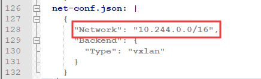

在 k8s-master-1 节点上部署 Flannel：执行此命令会下载镜像启动容器,据说此操作受限于网速

```
kubectl apply -f kube-flannel.yml
```

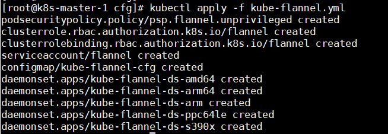

⑤ 检查部署状态

Flannel 会在 Node 上起一个 Flannel 的 Pod，可以查看 pod 的状态看 flannel 是否启动成功：

```
kubectl get pods -n kube-system -o wide
```


 Flannel 部署成功后，就可以看 Node 是否就绪：

```
kubectl get nodes -o wide
```


在 Node 上查看网络配置，可以看到多了一个 **flannel.1** 的虚拟网卡，这块网卡用于接收 Pod 的流量并转发出去。

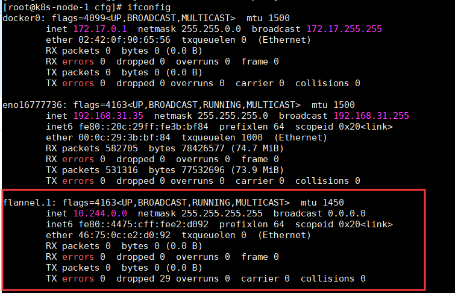

 ⑥ 授权apiServer可以访问kubelet

```
kubectl apply -f apiserver-to-kubelet-rbac.yaml
```

如果node节点部署出现问题，请输入以下命令检索

```
kubecti describe kube-node1
```

⑦测试创建 Pod

例如创建一个 Nginx 服务：

```sh
kubectl create deployment web --image=nginx
```


查看 Pod 状态：

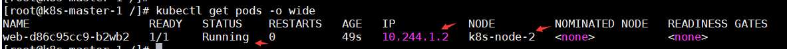

在对应的节点上可以看到部署的容器：

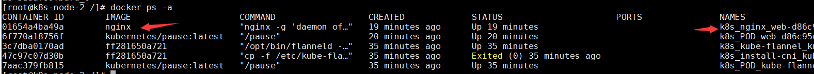

容器创建成功后，再在 Node 上查看网络配置，又多了一块 cni0 的虚拟网卡，cni0 用于 pod 本地通信使用。


暴露端口并访问 Nginx：

```
kubectl expose deployment web --port=80 --type=NodePort
```

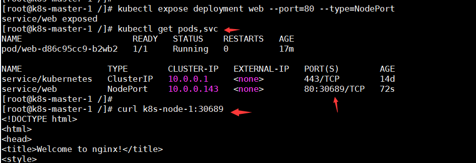

### 7、部署内部 DNS 服务

在Kubernetes集群推荐使用Service Name作为服务的访问地址，因此需要一个Kubernetes集群范围的DNS服务实现从Service Name到Cluster IP的解析，这就是Kubernetes基于DNS的服务发现功能。


① 部署 CoreDNS

下载CoreDNS配置文件：[coredns.yaml](https://raw.githubusercontent.com/kubernetes/kubernetes/master/cluster/addons/dns/coredns/coredns.yaml.base)

注意如下 clusterIP 一定要与 **kube-config.yaml** 中的 **clusterDNS** 保持一致


部署 CoreDNS：

```
$ kubectl apply -f coredns.yaml
```

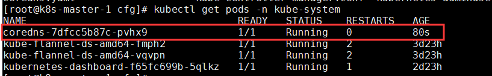

② 验证 CoreDNS

创建 busybox 服务：

```yaml
cat > busybox.yaml <<'EOF'
apiVersion: v1
kind: Pod
metadata:
  name: busybox
  namespace: default
spec:
  dnsPolicy: ClusterFirst
  containers:
  - name: busybox
    image: busybox:1.28.4
    command:
      - sleep
      - "3600"
    imagePullPolicy: IfNotPresent
  restartPolicy: Always
EOF# kubectl apply -f busybox.yaml
```

验证是否安装成功：

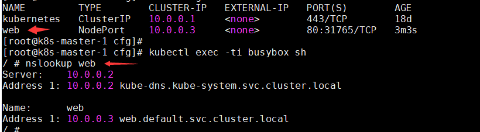

###8、远程管理K8S

默认情况下，k8s只能在master下管理，若将管理权限下移需要配置以下操作

①将kubectl指令文件拷贝到相应的node节点下

```sh
#在master上操作
scp /bin/kubectl root@k8s-node2: /bin
```

②生成管理员证书

```json
cat admin-csr.json
{
    "CN":"admin",
    "hosts":[],
    "key":{
        "algo":"rsa",
        "size":2048
    },
    "names":[
        {
            "C":"CN",
            "L":"BeiJing",
            "ST":"BeiJing",
            "O":"system:masters",
            "OU":"System"
        }
    ]
    
}

cfssl gencert -ca=ca.pem -ca-key=ca-key.pem -config=ca-config.json -profile=kubenates admin-csr.json | cfssljson -bare admin
```

③创建kubeconfig文件

```sh
#设置集群参数
kubectl config set-cluster Kubernetes \
  --server=http://192.168.31.61:6443 \
  --certificate-authority=ca.pem \
  --embed-certs=true \
  --kubeconfig=config
#设置客户端认证参数
kubectl config set-credentials cluster-admin \
  --certificate-authority=ca.pem \
  --embed-certs=true \
  --client-key=admin-key.pem \
  --client-certificate=admin.pem \
  --kubeconfig=config
#设置上下文参数
kubectl config set-context default \
  --cluster=Kubernetes \
  --user=cluster-admin \
  --kubeconfig=config
#设置默认上下文
kubectl config use-context default --kubeconfig=config
```

④将kubeconfig文件发送到node节点

```shell
scp config root@k8s-node2：/root/
mv /root/config/ /root/.kube/
kubectl get nodes
```


## 八、集群搭建 —— 部署 Dashboard

K8S 提供了一个 Web 版 Dashboard，用户可以用 dashboard 部署容器化的应用、监控应用的状态，能够创建和修改各种 K8S 资源，比如 Deployment、Job、DaemonSet 等。用户可以 Scale Up/Down Deployment、执行 Rolling Update、重启某个 Pod 或者通过向导部署新的应用。Dashboard 能显示集群中各种资源的状态以及日志信息。Kubernetes Dashboard 提供了 kubectl 的绝大部分功能。第三方还有个kuboard

### 1、部署 K8S Dashboard

通过此地址下载 dashboard yaml文件：[kubernetes-dashboard.yaml](http://mirror.faasx.com/kubernetes/dashboard/master/src/deploy/recommended/kubernetes-dashboard.yaml)

下载下来之后，需更新如下内容：通过 Node 暴露端口访问 dashboard


部署 dashboard：

```sh
kubectl apply -f kubernetes-dashboard.yaml
#查看dashboard的pod状态,注意如果不加-n默认访问的是default名称空间
kubectl get pods -n kubenates-dashboard
#查看之前的端口
kubectl get svc -n Kubernetes-dashboard
```

查看是否部署成功：

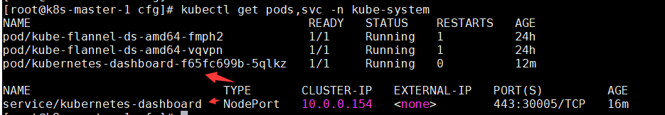

通过 https 访问 dashboard：


### 2、登录授权

Dashboard 支持 Kubeconfig 和 Token 两种认证方式，为了简化配置，我们通过配置文件为 Dashboard 默认用户赋予 admin 权限。

```yaml
cat > kubernetes-adminuser.yaml <<'EOF'
apiVersion: v1
kind: ServiceAccount
metadata:
  name: admin-user
  namespace: kube-system
---
apiVersion: rbac.authorization.k8s.io/v1beta1
kind: ClusterRoleBinding
metadata:
  name: admin-user
roleRef:
  apiGroup: rbac.authorization.k8s.io
  kind: ClusterRole
  name: cluster-admin
subjects:
- kind: ServiceAccount
  name: admin-user
  namespace: kube-system
EOF
```

授权：

```
kubectl apply -f kubernetes-adminuser.yaml
```

获取登录的 token：

```
kubectl -n kube-system describe secret $(kubectl -n kube-system get secret | grep admin-user | awk ' {print $1}')
```


通过token登录进 dashboard，就可以查看集群的信息：

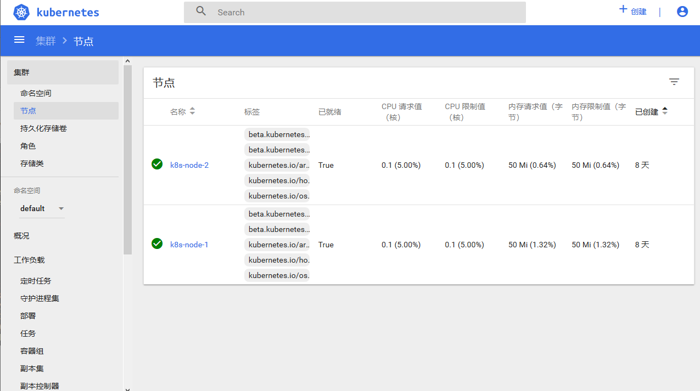

## 九、集群搭建 —— 多 Master 部署

### 1、部署Master2组件

① 将 k8s-master-1 上相关文件拷贝到 k8s-master-2 上

创建k8s工作目录：

```
mkdir -p /k8s/kubernetes
mkdir -p /k8s/etcd
```

拷贝 k8s 配置文件、执行文件、证书：

```
scp -r /k8s/kubernetes/{cfg,ssl,bin} root@k8s-master-2:/k8s/kubernetes
cp /k8s/kubernetes/bin/kubectl /usr/local/bin/
```

拷贝 etcd 证书：

```
scp -r /k8s/etcd/ssl root@k8s-master-2:/k8s/etcd
```

拷贝 k8s 服务的service文件：

```
scp /usr/lib/systemd/system/kube-* root@k8s-master-2:/usr/lib/systemd/system
```

② 修改 k8s-master-2 上的配置文件

修改 kube-apiserver.conf，修改IP为本机IP


③ 启动 k8s-master-2 组件

重新加载配置：

```
systemctl daemon-reload
```

启动 kube-apiserver：

```
systemctl start kube-apiserver
systemctl enable kube-apiserver
```

启动 kube-controller-manager：

```
systemctl start kube-controller-manager
systemctl enable kube-controller-manager
```

部署 kube-scheduler：

```
systemctl start kube-scheduler
systemctl enable kube-scheduler
```

④ 验证


### 2、部署 Nginx 负载均衡

为了保证 k8s master 的高可用，将使用 k8s-lb-master 和 k8s-lb-backup 这两台机器来部署负载均衡。这里使用 nginx 做负载均衡器，下面分别在 k8s-lb-master 和 k8s-lb-backup 这两台机器上部署 nginx。

① gcc等环境安装，后续有些软件安装需要这些基础环境

```sh
# gcc安装：
yum install gcc-c++
# PCRE pcre-devel 安装：
yum install -y pcre pcre-devel
# zlib 安装：
yum install -y zlib zlib-devel
#OpenSSL 安装：
yum install -y openssl openssl-devel
```

② 安装nginx

```sh
rpm -ivh https://nginx.org/packages/rhel/7/x86_64/RPMS/nginx-1.16.1-1.el7.ngx.x86_64.rpm
```

③ apiserver 负载配置

```sh
vim /etc/nginx/nginx.conf
```

增加如下配置：

```json
stream {
    log_format main '$remote_addr $upstream_addr - [$time_local] $status $upstream_bytes_sent';
    access_log /var/log/nginx/k8s-access.log main;

    upstream k8s-apiserver {
        server 192.168.31.24:6443;
        server 192.168.31.26:6443;
    }

    server {
        listen 6443;
        proxy_pass k8s-apiserver;
    }
}
```

④ 启动 nginx

```
systemctl start nginx
systemctl enable nginx
```

### 3、部署 KeepAlive

为了保证 nginx 的高可用，还需要部署 keepalive，keepalive 主要负责 nginx 的健康检查和故障转移。

① 分别在 k8s-lb-master 和 k8s-lb-backup 这两台机器上安装 keepalive

```
yum install keepalived -y
```

② master 启动 keepalived

修改 k8s-lb-master keepalived 配置文件

```properties
cat > /etc/keepalived/keepalived.conf <<'EOF'
global_defs {
   notification_email {
     acassen@firewall.loc
     failover@firewall.loc
     sysadmin@firewall.loc
   }
   notification_email_from Alexandre.Cassen@firewall.loc
   smtp_server 127.0.0.1
   smtp_connect_timeout 30
   router_id NGINX_MASTER
}

vrrp_script check_nginx {
   script "/etc/keepalived/check_nginx.sh" 
}

# vrrp实例
vrrp_instance VI_1 {
    state MASTER 
    interface ens33 
    virtual_router_id 51 
    priority 100
    advert_int 1 
    authentication {
        auth_type PASS
        auth_pass 1111
    }
    virtual_ipaddress {
        192.168.31.100/24 
    }
    track_script {
        check_nginx
    }
}
EOF
```

**配置说明：**

-   vrrp_script：用于健康检查nginx状态，如果nginx没有正常工作，就会进行故障漂移，使备节点接管VIP，这里通过 shell 脚本来检查nginx状态
-   state：keepalived 角色，主节点为 MASTER，备节点为 BACKUP
-   interface：接口，配置本地网卡名，keepalived 会将虚拟IP绑定到这个网卡上
-   virtual_router_id：#VRRP 路由ID实例，每个实例是唯一的
-   priority：优先级，备服务器设置90
-   advert_int：指定VRRP心跳包通告间隔时间，默认1秒
-   virtual_ipaddress：VIP，要与当前机器在同一网段，keepalived 会在网卡上附加这个IP，之后通过这个IP来访问Nginx，当nginx不可用时，会将此虚拟IP漂移到备节点上。

增加 check_nginx.sh 脚本，通过此脚本判断 nginx 是否正常：

```sh
cat > /etc/keepalived/check_nginx.sh <<'EOF'
#!/bin/bash
count=$(ps -ef | grep nginx | egrep -cv "grep|$$")
if [ "$count" -eq 0 ];then
    exit 1;
else 
    exit 0;
fi
EOF
```

增加可执行权限：

```
chmod +x /etc/keepalived/check_nginx.sh
```

启动 keepalived：

```
systemctl start keepalived
systemctl enable keepalived
```

③ backup 启动 keepalived

修改 k8s-lb-backup keepalived 配置文件

```ini
cat > /etc/keepalived/keepalived.conf <<'EOF'
global_defs {
   notification_email {
     acassen@firewall.loc
     failover@firewall.loc
     sysadmin@firewall.loc
   }
   notification_email_from Alexandre.Cassen@firewall.loc
   smtp_server 127.0.0.1
   smtp_connect_timeout 30
   router_id NGINX_BACKUP
}

vrrp_script check_nginx {
   script "/etc/keepalived/check_nginx.sh"
}

# vrrp实例
vrrp_instance VI_1 {
    state BACKUP
    interface eno16777736
    virtual_router_id 51
    priority 90
    advert_int 1
    authentication {
        auth_type PASS
        auth_pass 1111
    }
    virtual_ipaddress {
        192.168.31.100/24
    }
    track_script {
        check_nginx
    }
}
EOF
```

增加 check_nginx.sh 脚本：

```
cat > /etc/keepalived/check_nginx.sh <<'EOF'
#!/bin/bash
count=$(ps -ef | grep nginx | egrep -cv "grep|$$")
if [ "$count" -eq 0 ];then
    exit 1;
else 
    exit 0;
fi
EOF
```

增加可执行权限：

```
chmod +x /etc/keepalived/check_nginx.sh
```

启动 keepalived：

```
systemctl start keepalived
systemctl enable keepalived
```

④ 验证负载均衡

keepalived 已经将VIP附加到MASTER所在的网卡上


BACKUP节点上并没有

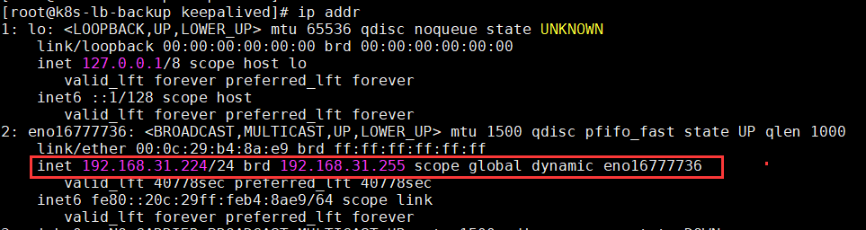

关闭 k8s-lb-master 上的nginx，可看到VIP已经不在了

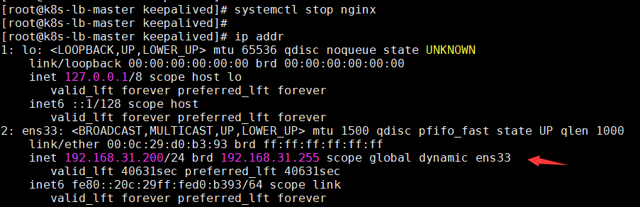

可以看到已经漂移到备节点上了，如果再重启 MASTER 上的 Ngnix，VIP又会漂移到主节点上。


访问虚拟IP还是可以访问的

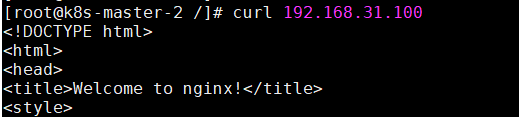

4、Node节点连接VIP

① 修改 node 节点的配置文件中连接 k8s-master 的IP为VIP

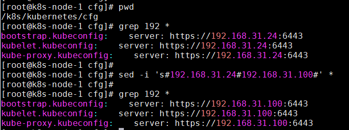

② 重启 kubelet 和 kube-proxy

```
systemctl restart kubelet
systemctl restart kube-proxy
```

③ 在 node 节点上访问VIP调用 apiserver 验证

Authorization 的token 是前面生成 token.csv 中的令牌。


 

至此，通过二进制方式安装 K8S 集群就算完成了！！


## 十、kubectl的使用

kubectl 是 Kubernetes 的命令行工具（CLI），是 Kubernetes 用户和管理员必备的管理工具（只能通过kubeclt调度apiserver）。

kubectl 提供了大量的子命令，方便管理 Kubernetes 集群中的各种功能。这里不再罗列各种子命令的格式，而是介绍下如何查询命令的帮助

kubectl -h 查看子命令列表

+   kubectl options 查看全局选项
+   kubectl <command> --help 查看子命令的帮助
+   kubectl [command] [PARAMS] -o=<format> 设置输出格式（如 json、yaml、jsonpath 等）
+   kubectl explain [RESOURCE] 查看资源的定义

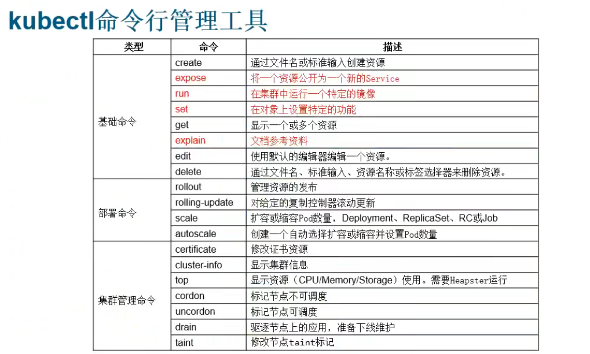


#十一 、k8s 组件调用流程


下面我们看下kubectl create deployment redis-deployment --image=redis下发之后，k8s 集群做了什么。

-   首先 controller-manager, scheduler, kubelet 都会和 apiserver 开始进行 List-Watch 模型，List 是拿到当前的状态，Watch 是拿到期望状态，然后 k8s 集群会致力于将当前状态达到达期望状态。

-   kubectl 下发命令到 apiserver，鉴权处理之后将创建信息存入 etcd，Deployment 的实现是使用 ReplicaSet 控制器，当 controller-manager 提前拿到当前的状态（pod=0），接着接收到期望状态，需要创建 ReplicaSet（pod=1），就会开始创建 Pod。

-   然后 scheduler 会进行调度，确认 Pod 被创建在哪一台 Node 上。

-   之后 Node 上的 kubelet 真正拉起一个 docker。

这些步骤中，apiserver 的作用是不言而喻的，所以说上接其余组件，下连 ETCD，但是 apiserver 是可以横向扩容的，然后通过负载均衡，倒是 ETCD 在 k8s 架构中成了瓶颈。

最开始看这架构的时候，会想着为啥 apiserver, scheduler, controller-manager 不合成一个组件，其实在 Google Borg 中，borgmaster 就是这样的，功能也是这些功能，但是合在了一起，最后他们也发现集群大了之后 borgmaster 会有些性能上的问题，包括 kubelet 的心跳就是很大一块，所以 k8s 从一开始开源，设计中有三个组件也是更好维护代码吧。
