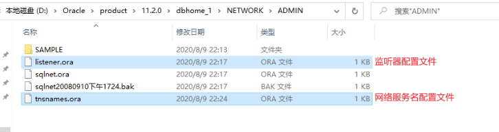
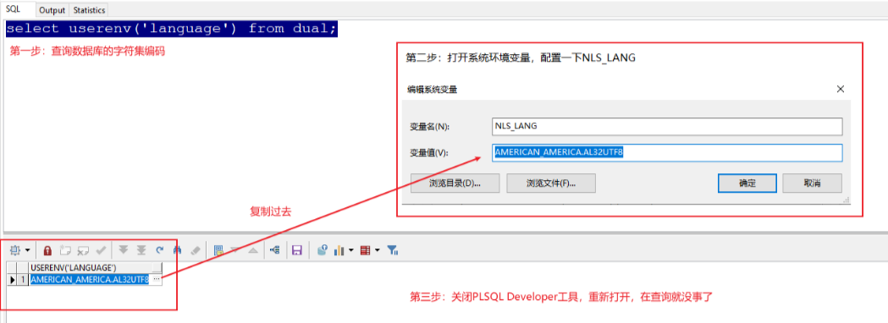

# Oracle

## Oracle的目录

1. admin目录
    描述：记录Oracle实例的配置，运行日志等文件，每一个实例一个目录，SID：SystemIDentifier的缩写，是Oracle实例的唯一标记，在Oracle中一个实例只能操作一个数据库，如果安装多个库那么就会有多个实例，我们可以通过实例SID来区分。

2. cfgtoollogs目录
    描述：下面子目录分别存放当运行dbca，emca，netca等图形化配置程序时的log。

3. checkpoints目录
    描述：存放检查点文件。

4. diag目录
    描述：Oracle11g添加的一个重组目录，其中的子目录，基本上Oracle每个组件都有了自己的单独目录，在Oracle10g中我们诟病的log文件散放在四处的问题终于得到解决，无论是asm还是crs还是rdbms，所有组件需要被用来诊断的log文件都存放在这个新的目录下。

5. flash_recovery_area(闪回区)目录
    描述：分配一个特定的目录位置来存放一些特定的恢复文件，用于集中和简化管理数据库恢复工作。闪回区可存储完全的数据文件备份，增量备份、数据文件副本、当前控制文件、备份的控制文件、spfile文件、快照控制文件、联机日志文件、归档日志、块跟踪文件、闪回日志。

6. oradata目录

    描述：存放数据文件。

   1. CONTROL01.CTL
        描述：Oracle数据库的控制文件
   2. EXAMPLE01.DBF
        描述：Oracle数据库表空间文件
   3. REDO01.LOG
        描述：Oracle数据库的重做日志文件，此文件有三个
   4. SYSAUX01.DBF
        描述：11g新增加的表空间，主要存储除数据字典以外的其他数据对象，由系统内部自动维护
   5. SYSTEM01.DBF
        描述：用于存放Oracle系统内部表和数据字典的数据。比如：表名、列名、用户名等
   6. TEMP01.DBF
        描述：临时表空间文件
   7. UNDOTBS01.DBF
        描述：撤销表空间文件，用来保存回滚数据
   8. USERS01.DBF
        描述：用户表空间

7. product目录
    描述：数据库实例存放文件。



注意环境变量也记得配置TNS_ADMIN

字符集设置
select userenv(‘language’) from dual;



## 语法

```sql
select [TOP|DISTINCT] [选择列表]|[*]
from 数据源
[where 查询条件]
[group by 分组条件]
[having 过滤条件]
[order by 排序条件 asc|desc nulls first|last];
```

执行顺
```sql
（5）select [（5-3）TOP|（5-2）DISTINCT] （5-1）[选择列表]|[*]
（1）from 数据源
（2）[where 查询条件]
（3）[group by 分组条件]
（4）[having 过滤条件]
（6）[order by asc|desc nulls first|last];
```

```sql
--内连接
select * from A, B where A.a = B.a;          --隐式
select * from A inner join B on A.a = B.a;   --显示

--外连接
    --左外
select * from A,B where A.a = B.a(+);            --隐式
select * from A left outer join B on A.a = B.a;  --显示
    --右外
select * from A,B where A.a(+) = B.a;                --隐式
select * from A right outer join B on A.a = B.a;     --显示
    --全外
select * from A full outer join B on A.a = B.a;

--交叉连接
select * from A, B;                    --隐式
select * from A cross join B;    --显示


/*
	union 		: 它会去除重复的，并且排序
	union all 	: 不会去除重复的，不会排序
*/
select * from A where a > 1500
union
select * from A where b = 20;

select * from A where a > 1500
union all
select * from A where b = 20;

--交集运算：找两个查询结果的交集
select * from A where a > 1500
intersect
select * from A where b = 20;

--差集运算：找两个查询结果的差集
select * from A where to_char(a,'yyyy') = '1981'
minus
select * from A where b = 'PRESIDENT' or b = 'MANAGER';

--列的类型,顺序,数量要一致，如果不够，可以使用null填充

```

```sql
--in的使用
select * from A where a in (select b from A where b is not null);
select * from A where a not in (select b from A where b is not null);

--any的使用
--查询出比10号部门任意一个员工薪资高的员工信息
select * from emp where sal > any (select sal from emp where deptno = 10);
select * from emp where sal > some (select sal from emp where deptno = 10);

--查询出比20号部门所有员工薪资高的员工信息
select * from emp where sal > all (select sal from emp where deptno = 20);

--查询有员工的部门的信息
select * from dept d1 where exists (select * from emp e1 where e1.deptno = d1.deptno);

```

```sql
--创建表空间
create tablespace 表空间的名称
datafile '文件的路径'
size 初始化大小
autoextend on
next 每次扩展的大小;

--删除表空间
drop tablespace 表空间的名称;

--创建用户
create user 用户名
identified by 密码
default tablespace 表空间的名称;

--授权用户
grant 系统权限列表 to 用户名;
或者
grant 实体权限列表 on 表名称 to 用户名;

--系统权限分类：（系统权限只能由DBA用户授出）
    --DBA：拥有全部特权，是系统最高权限，只有DBA才可以创建数据库结构。
    --RESOURCE：拥有Resource权限的用户只可以创建实体，不可以创建数据库结构。
    --CONNECT：拥有Connect权限的用户只可以登录Oracle，不可以创建实体，不可以创建数据库结构。

--实体权限分类：select、update、insert、alter、index、delete、all
```