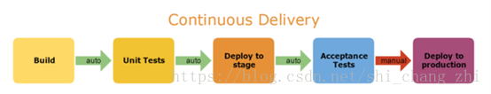
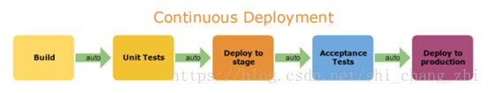
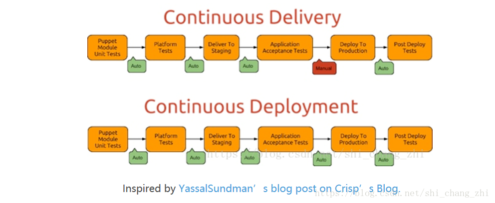

# 一.  持续集成

## 1. 概念

​    持续集成是指软件个人研发的部分向软件整体部分交付，频繁进行集成以便更快地发现其中的错误。“持续集成”源自于极限编程（XP），是 XP 最初的 12 种实践之一。

## 2. 目的

​    持续集 成的目的，就是让产品可以快速迭代，同时还能保持高质量。它的核心措施是，代码集成到主干之前，必须通过自动化测试。只要有一个测试用例失败，就不能集成。

Martin Fowler 说过，”持续集成并不能消除 Bug，而是让它们非常容易发现和改正。”

## 3. CI需要具备的条件：
+ 全面的自动化测试。这是实践持续集成&持续部署的基础，同时，选择合适的自动化测试工具也极其重要；
+ 灵活的基础设施。容器，虚拟机的存在让开发人员和 QA 人员不必再大费周折；
+ 版本控制工具。如 Git，CVS，SVN 等；
+ 自动化的构建和软件发布流程的工具，如 Jenkins，flow.ci；
+ 反馈机制。如构建/测试的失败，可以快速地反馈到相关负责人，以尽快解决达到一个更稳定的版本。

## 4. 持续集成的优点
+ “快速失败”，在对产品没有风险的情况下进行测试，并快速响应；
+ 最大限度地减少风险，降低修复错误代码的成本；
+ 将重复性的手工流程自动化，让工程师更加专注于代码；
+ 保持频繁部署，快速生成可部署的软件；
+ 提高项目的能见度，方便团队成员了解项目的进度和成熟度；
+ 增强开发人员对软件产品的信心，帮助建立更好的工程师文化。

## 5. 主要好处
两个：

+ 快速发现错误。每完成一点更新，就集成到主干，可以快速发现错误，定位错误也比较容易。
+ 防止分支大幅偏离主干。如果不是经常集成，主干又在不断更新，会导致以后集成的难度变大，甚至难以集成。

## 6. 持续集成，该从何入手
​	最重要的一环是选择合适的持续集成系统。是搭建私有部署还是选择托管型持续集成系统，关键在于团队运行的基础设施，团队对持续集成系统的资源投入力度。

​	对比一下私有部署和托管型持续集成系统，或许能帮助你更好地做出选择。

​	Self Hosted CI 指的是将软件部署在公司的机房或内网中，需要提供多台服务器来完成 CI 系统的运转，同时需要对不同机器之间进行环境配置。比如Maven 或 Gradle 或 Jenkins ，他们的特点是自由开源，且文档支持广泛。优点在于对构建环境有完全的控制权，能够实现完全定制。但需要搭建环境和配置、维护成本高，需要买专门的机器，花费较多人力物力且更新迁移风险高；

​	Hosted CI 指的是由 SaaS 型的 CI 服务，全程在线进行构建配置，不需要考虑装机器，装软件，环境搭建等成本。常见的有 CircleCI，Codeship 和TravisCI 等，还有国内最新的持续集成服务——flow.ci 。SaaS 型的 CI 的特点在于无需额外机器，几分钟就可以用起来。可以根据你的需要动态调度资源。省时，省心，省力。

​	整体而言，Jenkins过去一直是大部分公司的选择，但这个现象正在发生改变，随着公有云服务、Docker，SaaS 的普及，越来越多的企业开始选择 Hosted CI，也就是托管型持续集成系统。

​	另外，在选择合适的持续集成服务时，还需要考量系统的灵活度以适应公司不同阶段的开发测试需求。

​	**选择持续集成系统只是持续集成应用的其中一步，还需要建立合适的持续集成文化比如代码质量管控、测试文化等。做好持续集成，可为持续交付与持续部署打好坚实基础。**

## 7. 流程

根据持续集成的设计，代码从提交到生产，整个过程有以下几步。

##### （1）提交

​			流程的第一步，是开发者向代码仓库提交代码。所有后面的步骤都始于本地代码的一次提交(commit)。

##### （2）测试(第一轮)

​			代码仓库对 commit 操作配置了钩子(hook)，只要提交代码或者合并进主干，就会跑自动化测试。

测试有好几种：

+ 单元测试：针对函数或模块的测试

+ 集成测试：针对整体产品的某个功能的测试，又称功能测试

+ 端对端测试：从用户界面直达数据库的全链路测试 

    第一轮至少要跑单元测试。

##### （3）构建
​       通过第一轮测试，代码就可以合并进主干，就算可以交付了。

​	交付后，就先进行构建(build)，再进入第二轮测试。所谓构建，指的是将源码转换为可以运行的实际代码，比如安装依赖，配置各种资源(样式表、JS 脚本、图片)等等。

常用的构建工具如下：

+ Jenkins
+ Travis
+ Codeship
+ Strider
           Jenkins 和 Strider 是开源软件，Travis 和 Codeship 对于开源项目可以免费使用。它们都会将构建和测试，在一次运行中执行完成。

##### （4）测试(第二轮)
​       构建完成，就要进行第二轮测试。如果第一轮已经涵盖了所有测试内容，第二轮可以省略，当然，这时构建步骤也要移到第一轮测试前面。

​       第二轮是全面测试，单元测试和集成测试都会跑，有条件的话，也要做端对端测试。所有测试以自动化为主，少数无法自动化的测试用例，就要人工跑。
​    
​       需要强调的是，新版本的每一个更新点都必须测试到。如果测试的覆盖率不高，进入后面的部署阶段后，很可能会出现严重的问题。

##### （5）部署
​       通过了第二轮测试，当前代码就是一个可以直接部署的版本(artifact)。将这个版本的所有文件打包( tar filename.tar * )存档，发到生产服务器。

​       生产服务器将打包文件，解包成本地的一个目录，再将运行路径的符号链接(symlink)指向这个目录，然后重新启动应用。这方面的部署工具有 Ansible，Chef，Puppet等。

##### （6）回滚
​       一旦当前版本发生问题，就要回滚到上一个版本的构建结果。最简单的做法就是修改一下符号链接，指向上一个版本的目录。

*************************************************************************************************************

# 二.  持续交付
## 1. 概念

​       持续交付在持续集成的基础上，将集成后的代码部署到更贴近真实运行环境的「类生产环境」中。给质量团队或者用户，以供评审。如果评审通过，代码就进入生产阶段。持续交付优先于整个产品生命周期的软件部署，建立在高水平自动化持续集成之上。

## 2. 目的

​       持续交付用来确保让代码能够快速、安全的部署到产品环境中，它通过将每一次改动都提交到一个模拟产品环境中，使用严格的自动化测试，确保业务应用和服务能符合预期。

		持续交付可以看作持续集成的下一步。它强调的是，不管怎么更新，软件是随时随地可以交付的。

​                               

​       试想想，如果说等到所有东西都完成了才向下个环节交付，导致所有的问题只能再最后才爆发出来，解决成本巨大甚至无法解决。比如，我们完成单元测试后，可以把代码部署到连接数据库的 Staging 环境中进行更多的自动化测试。如果代码没有问题，可以继续手动部署到生产环境中。当然，持续交付并不是指软件每一个改动都要尽快部署到产品环境中，它指的是任何的代码修改都可以在任何时候实施部署。

## 3. 持续交付的好处
持续交付和持续集成的优点非常相似：

+ 快速发布。能够应对业务需求，并更快地实现软件价值。
+ 编码->测试->上线->交付的频繁迭代周期缩短，同时获得迅速反馈；
+ 高质量的软件发布标准。整个交付过程标准化、可重复、可靠，
+ 整个交付过程进度可视化，方便团队人员了解项目成熟度；
+ 更先进的团队协作方式。从需求分析、产品的用户体验到交互 设计、开发、测试、运维等角色密切协作，相比于传统的瀑布式软件团队，更少浪费。

*************************************************************************************************************

# 三.  持续部署
## 1. 概念
​       持续部署(continuous deployment)是持续交付的下一步或者说更高阶段，指的是代码通过评审以后（或者是通过自动化测试以后），自动部署到生产环境。持续部署是持续交付的最高阶段。这意味着，所有通过了一系列的自动化测试的改动都将自动部署到生产环境。它也可以被称为“Continuous Release”。 大多数的公司如果没有制度的约束或其它条件的影响，都应该以持续部署为目标。

​       持续部署(continuous deployment)是持续交付的下一步，指的是代码通过评审以后，自动部署到生产环境。

## 2. 目标

​       持续部署的目标是，代码在任何时刻都是可部署的，可以进入生产阶段。

​       有很多的业务场景里，一种业务需要等待另外的功能特征出现才能上线，这使得持续部署成为不可能。虽然使用功能切换能解决很多这样的情况，但并不是每次都会这样。所以，持续部署是否适合你的公司是基于你们的业务需求——而不是技术限制。

​                             

**为什么说持续部署是理想的工作流程？**

​       “开发人员提交代码，持续集成服务器获取代码，执行单元测试，根据测试结果决定是否部署到预演环境，如果成功部署到预演环境，进行整体验收测试，如果测试通过，自动部署到产品环境，全程自动化高效运转。”

实际上，产品在从需求到部署的过程中，会经历若干种不同的环境，例如 QA 环境、各种自动化测试运行环境、生产环境等。这些环境的搭建、配置、管理，产品在不同环 境中的具体部署，状况是比较非常复杂的，从头到尾地全自动持续部署的确困难。那么，如果能做到持续交付，保证代码在模拟环境没问题，也许团队成员做到真正的心理有数。

## 3. 持续部署的优点
​       持续部署主要好处是，可以相对独立地部署新的功能，并能快速地收集真实用户的反馈。

​       “You build it, you run it”，这是 Amazon 一年可以完成 5000 万次部署，平均每个工程师每天部署超过 50 次的核心秘籍。

## 4. 持续部署和储蓄交付区别
​       持续部署的前提是能自动化完成测试、构建、部署等步骤。它与持续交付的区别，可以参考下图：

  

虽然持续部署并不适合所有公司，但持续交付绝对应该是每个公司需要追求的目标。

# 四.  最后
​       「持续集成（ContinuousIn	tegration）」、「持续交付（Continuous Delivery）」和「持续部署（Continuous Deployment）」提供了一个优秀的 DevOps 环境，对于整个团队来说，好处与挑战并行。无论如何，频繁部署、快速交付以及开发测试流程自动化都将成为未来软件工程的重要组成部分。