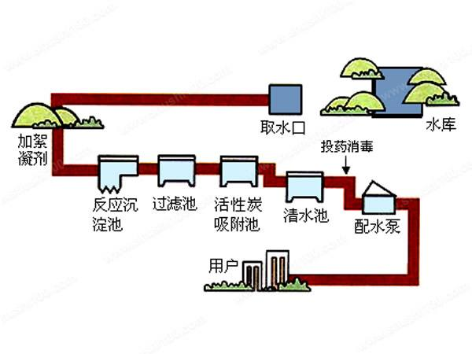
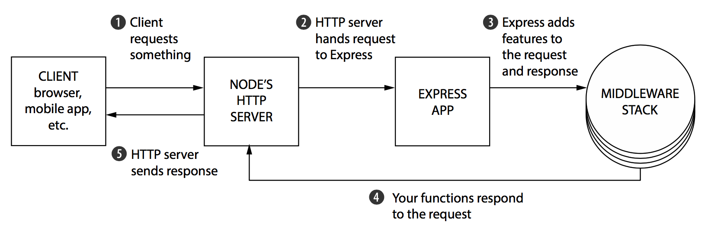
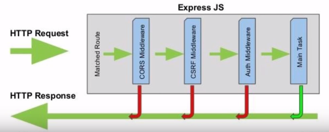
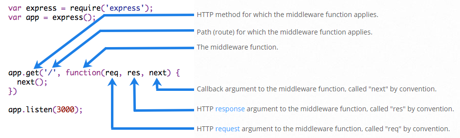
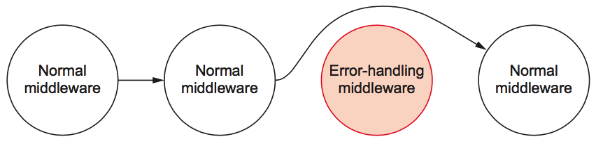
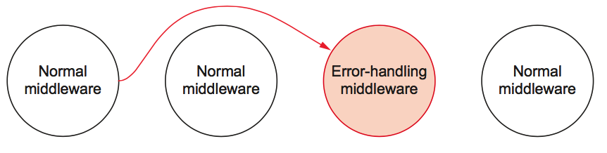

# 中间件 middleware


# 中间件




# 为什么需要中间件？

把一个大的 request 事件，变为很多小的函数来处理。




# 基本概念

1. 中间件就是一个函数，在这个函数中能做什么？
  - 执行任何代码。
  - 修改请求和响应对象。
  - 终结请求-响应循环。
  - 调用堆栈中的下一个中间件。

2. 这个函数通常有 3 个参数，req、res、next
3. 错误处理中间件有 4 个参数，err, req, res, next
4. 中间件按照注册顺序，依次判断是否匹配，如果匹配则执行；如果不匹配则继续判断后续注册的中间件是否匹配。【即便注册了多个中间件，执行的时候也只会根据匹配的路由来执行相应的中间件，**不是**所有注册的中间件每次请求都会全部被执行！】
5. 如果当前中间件没有结束用户请求（结束服务器响应）（res.end()），那么就要调用 next() ，否则请求就会挂起








# 特点

1. 根据注册顺序，依次判断匹配(判断是否匹配注册时的路由，如果匹配，那么执行该中间件。如果不匹配则，进行判断下一个注册的中间件注册时的路由是否匹配)并执行
2. 如果当前中间件没有结束请求（res.end())，那么当前中间件应该调用 next() 方法将控制流转到下一个中间件，最后一个中间件通常不需要调用 next() 方法，而是直接终止请求。
3. 中间件会从最先开始注册的那个开始执行，执行的时候先判断是否匹配路由，如果匹配才会执行对应的中间件代码。
4. 执行完毕该中间件时，如果有调用 next() 那么继续找下一个匹配的中间件，如果找到了就执行，找不到继续向后找
5. 如果一个匹配的中间件也没找到，那么 express 中有一个兜底的中间件（就是那个 `Can not GET /`）
  - 自己写一个兜底的中间件替换默认的那个


# express 中的中间件分类

1. 应用程序级中间件
  - 通过 app 对象来挂载的中间件
  - app.use()、app.get()、app.post()、...
2. 路由级中间件
  - 通过 router 对象来挂载的中间件
  - router.use()、router.get()、router.post()、......
3. 错误处理中间件
  - 必须写4个参数 err、req、res、next
  - 错误处理中间件一般定义在所有中间件的最后
  - 在错误处理中间件中如果不调用 next(err), 那么必须要结束请求。一般错误处理中间件就是最后一个中间件了，所以需要 res.end()
4. 内置中间件
  -  express.static
5. 第三方中间件
  - body-parser 等安装的第三方中间件
  - [第三方中间件列表-中文](http://www.expressjs.com.cn/resources/middleware.html)
  - [第三方中间件列表-英文](http://expressjs.com/en/resources/middleware.html)


# 错误处理中间件执行逻辑

当调用 next(err) 时候会进入错误处理中间件





# 编写一个 my-body-parser 插件

```javascript
var querystring = require('querystring');

module.exports = function (req, res, next) {

  var body = [];
  req.on('data', function (chunk) {
    // body...
    body.push(chunk);
  });

  req.on('end', function () {
    // body...
    var buf = Buffer.concat(body);

    req.body = querystring.parse(buf.toString());
    console.log(req.body);

    
    next();
  });
};
```
