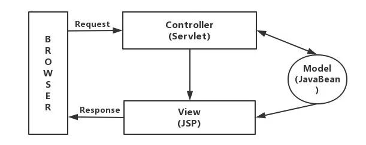
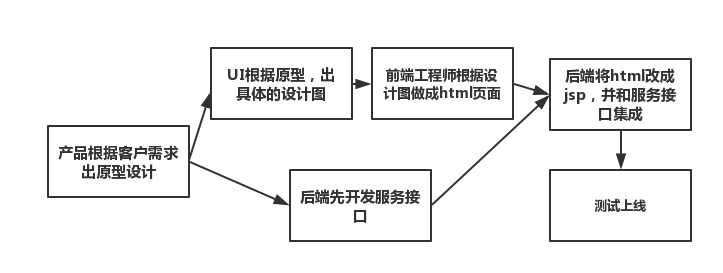
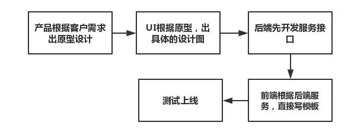
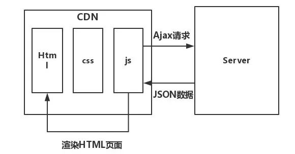
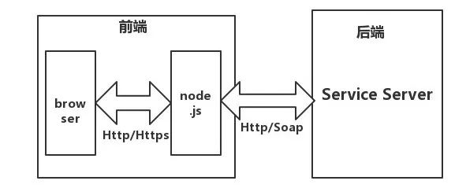
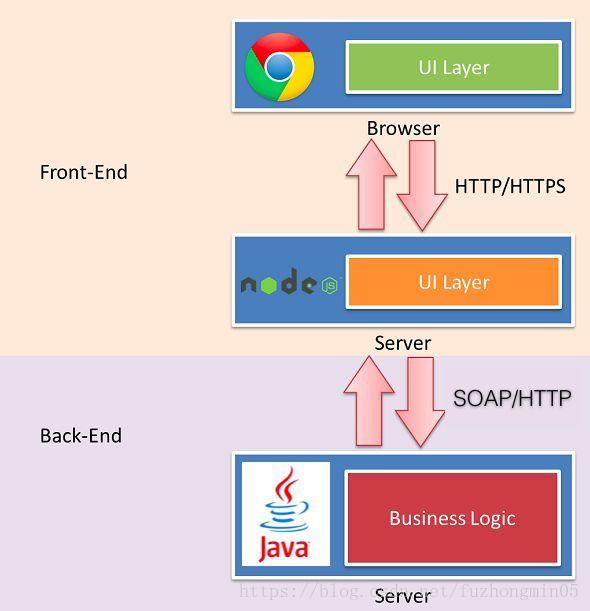
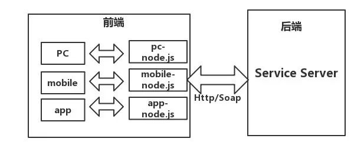
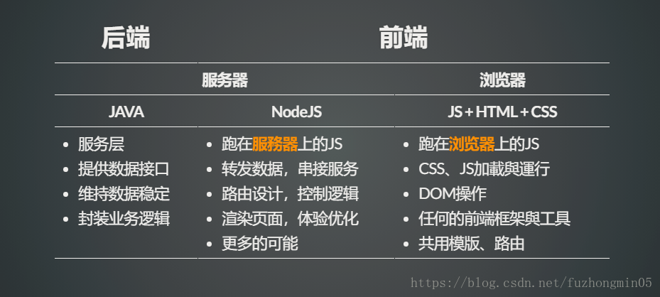

# 1、背景

​       前后端分离已成为互联网项目开发的业界标准使用方式，通过nginx+tomcat的方式（也可以中间加一个nodejs）有效的进行解耦，并且前后端分离会为以后的大型分布式架构、弹性计算架构、微服务架构、多端化服务（多种客户端，例如：浏览器，车载终端，安卓，IOS等等）打下坚实的基础。这个步骤是系统架构从猿进化成人的必经之路。

​	核心思想是前端HTML页面通过AJAX调用后端的RESTFUL API接口并使用JSON数据进行交互。

​	Web服务器：一般指像Nginx，Apache这类的服务器，他们一般只能解析静态资源；

​	应用服务器：一般指像Tomcat，Jetty，Resin这类的服务器可以解析动态资源也可以解析静态资源，但解析静态资源的能力没有web服务器好；

​	一般都是只有web服务器才能被外网访问，应用服务器只能内网访问。

​	以前的Java Web项目大多数都是Java程序员又当爹又当妈，又搞前端，又搞后端。随着时代的发展，渐渐的许多大中小公司开始把前后端的界限分的越来越明确，前端工程师只管前端的事情，后端工程师只管后端的事情。正所谓术业有专攻，一个人如果什么都会，那么他毕竟什么都不精。大中型公司需要专业人才，小公司需要全才，但是对于个人职业发展来说，前后端需要分离。

# 2、未分离时代（各种耦合）
​      早期主要使用MVC框架，Jsp+Servlet的结构图如下：




  大致就是所有的请求都被发送给作为控制器的Servlet，它接受请求，并根据请求信息将它们分发给适当的JSP来响应。同时，Servlet还根据JSP的需求生成JavaBeans的实例并输出给JSP环境。JSP可以通过直接调用方法或使用UseBean的自定义标签得到JavaBeans中的数据。需要说明的是，这个View还可以采用 Velocity、Freemaker 等模板引擎。使用了这些模板引擎，可以使得开发过程中的人员分工更加明确，还能提高开发效率。

  那么，在这个时期，开发方式有如下两种：

###### 方式一  

###### 方式二 


​      方式二已经逐渐淘汰。主要原因有两点：
​      1）前端在开发过程中严重依赖后端，在后端没有完成的情况下，前端根本无法干活；
​      2）由于趋势问题，会JSP，懂velocity，freemarker等模板引擎的前端越来越少；
​    

​	 因此，方式二逐渐不被采用。然而，不得不说一点，方式一，其实很多小型传统软件公司至今还在使用。那么，方式一和方式二具有哪些共同的缺点呢?
​       1、前端无法单独调试，开发效率低；

​       2、 前端不可避免会遇到后台代码，例如：

```
<body>
   <%
       request.setCharacterEncoding("utf-8")
       String name=request.getParameter("username");
       out.print(name);
   %>
</body>
```


​      这种方式耦合性太强。那么，就算你用了freemarker等模板引擎，不能写Java代码。那前端也不可避免的要去重新学习该模板引擎的模板语法，无谓增加了前端的学习成本。正如我们后端开发不想写前端一样，你想想如果你的后台代码里嵌入前端代码，你是什么感受？因此，这种方式十分不妥。

​		3、JSP本身所导致的一些其他问题 比如，<font color=red >JSP第一次运行的时候比较缓慢，因为里头包含一个将JSP翻译为Servlet的步骤</font>。再比如因为同步加载的原因，在JSP中有很多内容的情况下，页面响应会很慢。

# 3、半分离时代
​      前后端半分离，前端负责开发页面，通过接口（Ajax）获取数据，采用Dom操作对页面进行数据绑定，最终是由前端把页面渲染出来。这也就是Ajax与SPA应用（单页应用）结合的方式，其结构图如下：



步骤如下：
（1）浏览器请求，CDN返回HTML页面；
（2）HTML中的JS代码以Ajax方式请求后台的Restful接口；
（3）接口返回Json数据，页面解析Json数据，通过Dom操作渲染页面；
      后端提供的都是以JSON为数据格式的API接口供Native端使用，同样提供给WEB的也是JSON格式的API接口。

那么意味着WEB工作流程是：
      1、打开web，加载基本资源，如CSS，JS等；
      2、发起一个Ajax请求再到服务端请求数据，同时展示loading；
      3、得到json格式的数据后再根据逻辑选择模板渲染出DOM字符串；
      4、将DOM字符串插入页面中web view渲染出DOM结构；
      

​		这些步骤都由用户所使用的设备中逐步执行，也就是说用户的设备性能与APP的运行速度联系的更紧换句话说就是如果用户的设备很低端，那么APP打开页面的速度会越慢。
​    

​		为什么说是半分离的？因为不是所有页面都是单页面应用，在<font color=red >多页面应用的情况下，前端因为没有掌握controller层，前端需要跟后端讨论，我们这个页面是要同步输出呢，还是异步Json渲染呢？</font>而且，即使在这一时期，通常也是一个工程师搞定前后端所有工作。因此，在这一阶段，只能算半分离。
​	
首先，这种方式的优点是很明显的。前端不会嵌入任何后台代码，前端专注于HTML、CSS、JS的开发，不依赖于后端。自己还能够模拟Json数据来渲染页面。发现Bug，也能迅速定位出是谁的问题。
​	

​		然而，在这种架构下，还是存在明显的弊端的。最明显的有如下几点：
​	  1）JS存在大量冗余，在业务复杂的情况下，页面的渲染部分的代码，非常复杂；
​	  2）在Json返回的数据量比较大的情况下，渲染的十分缓慢，会出现页面卡顿的情况；
​	  3）SEO（ Search Engine Optimization，即搜索引擎优化）非常不方便，由于搜索引擎的爬虫无法爬下JS异步渲染的数据，导致这样的页面，SEO会存在一定的问题；
​	  4）资源消耗严重，在业务复杂的情况下，一个页面可能要发起多次HTTP请求才能将页面渲染完毕。可能有人不服，<font color=red >觉得PC端建立多次HTTP请求也没啥。那你考虑过移动端么，知道移动端建立一次HTTP请求需要消耗多少资源么？</font>
​	

正是因为如上缺点，我们才亟需真正的前后端分离架构。

# 4、分离时代
​      大家一致认同的前后端分离的例子就是SPA(Single-page application)，所有用到的展现数据都是后端通过异步接口(AJAX/JSONP)的方式提供的，前端只管展现。从某种意义上来说，SPA确实做到了前后端分离，但这种方式存在两个问题：

+ WEB服务中，SPA类占的比例很少。很多场景下还有同步/同步+异步混合的模式，SPA不能作为一种通用的解决方案；

+ 现阶段的SPA开发模式，接口通常是按照展现逻辑来提供的，而且为了提高效率我们也需要后端帮我们处理一些展现逻辑，这就意味着后端还是涉足了view层的工作，不是真正的前后端分离。
          

    SPA式的前后端分离，从物理层做区分（认为只要是客户端的就是前端，服务器端就是后端）这种分法已经无法满足前后端分离的需求，我们认为从职责上划分才能满足目前的使用场景：

+ 前端负责view和controller层

+ 后端只负责model层，业务处理与数据持久化等
          

    controller层与view层对于目前的后端开发来说，只是很边缘的一层，目前的java更适合做持久层、model层的业务。

    在前后端彻底分离这一时期，前端的范围被扩展，controller层也被认为属于前端的一部分。在这一时期：
          前端：负责View和Controller层。
          后端：只负责Model层，业务/数据处理等。
    
    可是服务端人员对前端HTML结构不熟悉，前端也不懂后台代码呀，controller层如何实现呢？这就是node.js的妙用了，<font color=red >node.js适合运用在高并发、I/O密集、少量业务逻辑的场景</font>。最重要的一点是，前端不用再学一门其他的语言了，对前端来说，上手度大大提高。
    
    

可以就把Nodejs当成跟前端交互的api。总得来说，NodeJs的作用在MVC中相当于C（控制器）。<font color=red >Nodejs路由的实现逻辑是把前端静态页面代码当成字符串发送到客户端（例如浏览器），简单理解可以理解为路由是提供给客户端的一组api接口，只不过返回的数据是页面代码的字符串而已。</font>
    
用NodeJs来作为桥梁架接服务器端API输出的JSON。<font color=red >后端出于性能和别的原因，提供的接口所返回的数据格式也许不太适合前端直接使用，前端所需的排序功能、筛选功能，以及到了视图层的页面展现，也许都需要对接口所提供的数据进行二次处理。这些处理虽可以放在前端来进行，但也许数据量一大便会浪费浏览器性能。因而现今，增加Node中间层便是一种良好的解决方案。</font>


      浏览器(webview)不再直接请求JSP的API，而是：
      1）浏览器请求服务器端的NodeJS；
      2）NodeJS再发起HTTP去请求JSP；
      3）JSP依然原样API输出JSON给NodeJS；
      4）NodeJS收到JSON后再渲染出HTML页面；
      5）NodeJS直接将HTML页面flush到浏览器；
      

​	这样，浏览器得到的就是普通的HTML页面，而不用再发Ajax去请求服务器了。

​	淘宝的前端团队提出的中途岛(Midway Framework)的架构如下图所示：



增加node.js作为中间层，具体有哪些好处呢？

​	(1)适配性提升；我们其实在开发过程中，经常会给PC端、mobile、app端各自研发一套前端。其实对于这三端来说，<font color=red >大部分端业务逻辑是一样的。唯一区别就是交互展现逻辑不同。如果controller层在后端手里，后端为了这些不同端页面展示逻辑，自己维护这些controller，模版无法重用，徒增和前端沟通端成本。</font> 如果增加了node.js层，此时架构图如下：



​	在该结构下，每种前端的界面展示逻辑由node层自己维护。如果产品经理中途想要改动界面什么的，可以由前端自己专职维护，后端无需操心。前后端各司其职，后端专注自己的业务逻辑开发，前端专注产品效果开发。

​	(2)响应速度提升；我们有时候，会遇到后端返回给前端的数据太简单了，<font color=red >前端需要对这些数据进行逻辑运算。那么在数据量比较小的时候，对其做运算分组等操作，并无影响。但是当数据量大的时候，会有明显的卡顿效果。</font>这时候，node中间层其实可以将很多这样的代码放入node层处理、也可以替后端分担一些简单的逻辑、又可以用模板引擎自己掌握前台的输出。这样做灵活度、响应度都大大提升。

​	举个例子，即使做了页面静态化之后，前端依然还是有不少需要实时从后端获取的信息，这些信息都在不同的业务系统中，所以需要前端发送5，6个异步请求来。有了NodeJs之后，前端可以在NodeJs中去代理这5个异步请求。还能很容易的做bigpipe，这块的优化能让整个渲染效率提升很多。在PC上你觉得发5,6个异步请求也没什么，但是在无线端，在客户手机上建立一个http请求开销很大。有了这个优化，性能一下提升好几倍。
​	

​	(3)性能得到提升；大家应该都知道单一职责原则。从该角度来看，我们，<font color=red >请求一个页面，可能要响应很多个后端接口，请求变多了，自然速度就变慢了，这种现象在mobile端更加严重。采用node作为中间层，将页面所需要的多个后端数据，直接在内网阶段就拼装好，再统一返回给前端，</font>会得到更好的性能。

​	(4)异步与模板统一；淘宝首页就是被几十个HTML片段（每个片段一个文件）拼装成，之前PHP同步include这几十个片段，一定是串行的，Node可以异步，读文件可以并行，一旦这些片段中也包含业务逻辑，异步的优势就很明显了，真正做到哪个文件先渲染完就先输出显示。前端机的文件系统越复杂，页面的组成片段越多，这种异步的提速效果就越明显。前后端模板统一在无线领域很有用，PC页面和WIFI场景下的页面适合前端渲染（后端数据Ajax到前端），2G、3G弱网络环境适合后端渲染（数据随页面吐给前端），所以同样的模板，在不同的条件下走不同的渲染渠道，模板只需一次开发。
​    
增加NodeJS中间层后的前后端职责划分：


# 5、总结
​	从经典的JSP+Servlet+JavaBean的MVC时代，到SSM（Spring + SpringMVC + Mybatis）和SSH（Spring + Struts + Hibernate）的Java 框架时代，再到前端框架（KnockoutJS、AngularJS、vueJS、ReactJS）为主的MV*时代，然后是Nodejs引领的全栈时代，技术和架构一直都在进步。虽然“基于NodeJS的全栈式开发”模式很让人兴奋，但是把基于Node的全栈开发变成一个稳定，让大家都能接受的东西还有很多路要走。创新之路不会止步，无论是前后端分离模式还是其他模式，都是为了更方便得解决需求，但它们都只是一个“中转站”。前端项目与后端项目是两个项目，放在两个不同的服务器，需要独立部署，两个不同的工程，两个不同的代码库，不同的开发人员。前端只需要关注页面的样式与动态数据的解析及渲染，而后端专注于具体业务逻辑。