# 三角函数

|                                                        | **锐角三角函数**                                             | **任意角三角函数**                                           |
| ------------------------------------------------------ | ------------------------------------------------------------ | ------------------------------------------------------------ |
| 图形                                                   |  | 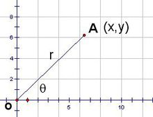 |
| [正弦](https://baike.baidu.com/item/正弦)（sin）       | 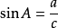 |  |
| [余弦](https://baike.baidu.com/item/余弦/73670)（cos） | 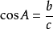 | 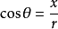 |
| [正切](https://baike.baidu.com/item/正切)（tan或tg）   | 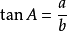 | 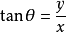 |
| [余切](https://baike.baidu.com/item/余切)（cot或ctg）  | 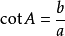 | 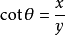 |
| [正割](https://baike.baidu.com/item/正割)（sec）       | 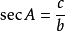 | 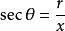 |
| [余割](https://baike.baidu.com/item/余割)（csc）       | 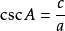 |  |

  

1）对角相乘乘积为1，即sinθ·cscθ=1； cosθ·secθ=1； tanθ·cotθ=1。

2）六边形任意相邻的三个顶点代表的三角函数，处于中间位置的函数值等于与它相邻两个函数值的乘积，如：sinθ=cosθ·tanθ；tanθ=sinθ·secθ...

3）阴影部分的三角形，处于上方两个顶点的平方之和等于下顶点的平方值，如：

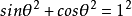 ；  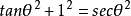 ；。

### 变化规律

正弦值在 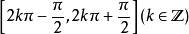 随角度增大（减小）而增大（减小），在 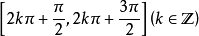 随角度增大（减小）而减小（增大）；

余弦值在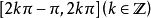 随角度增大（减小）而增大（减小），在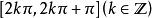随角度增大（减小）而减小（增大）；

正切值在 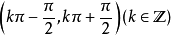 随角度增大（减小）而增大（减小）；

余切值在 随角度增大（减小）而减小（增大）。

 除了上述六个常见的函数，还有一些不常见的三角函数： 

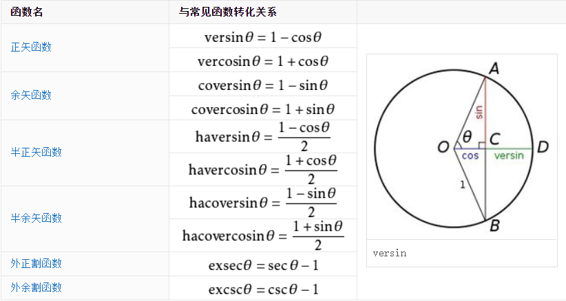

